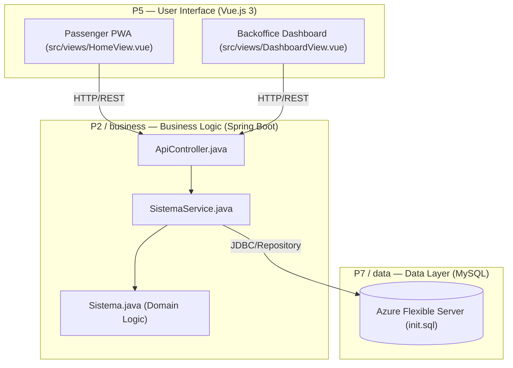
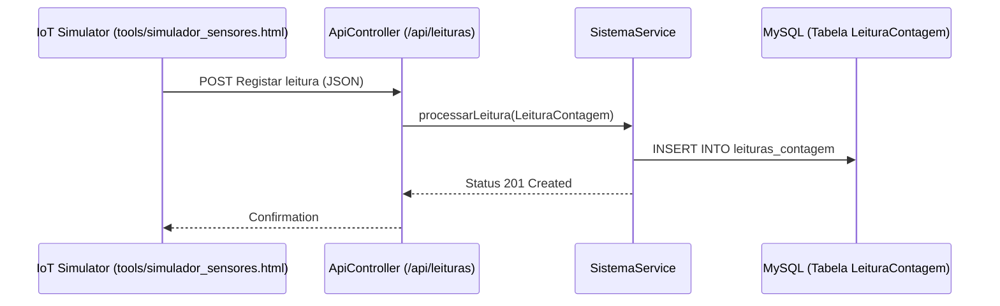

# Visão Geral da Plataforma PGU/TUB

A **Plataforma de Gestão Unificada (PGU)** é um sistema de prova de conceito desenvolvido para os **Transportes Urbanos de Braga (TUB)**. Tem como objetivo fornecer uma solução inteligente de gestão de frota integrando, em tempo real, dados de sensores IoT com painéis operacionais e interfaces móveis para os passageiros [README.md:1-3]().

O sistema facilita a monitorização da lotação dos autocarros, da eficiência das rotas e da localização dos veículos em tempo real, permitindo que os operadores tomem decisões baseadas em dados, ao mesmo tempo que disponibiliza aos passageiros informação de transportes precisa.

## Propósito e Âmbito do Sistema
A plataforma PGU serve dois grupos principais de utilizadores através de um backend unificado:
1. **Operadores de Frota (Backoffice):** Acesso a KPIs, mapas de frota em tempo real, análise da correlação de lotação e gestão de alertas [README.md:13]().
2. **Passageiros (PWA):** Interface mobile-first para planeamento de viagens, localização de autocarros em tempo real e bilhética digital [README.md:21]().

## Camadas de Arquitetura
A plataforma segue uma arquitetura de três camadas, mapeada de acordo com o **método 4SRS** [README.md:9-15]().

### Diagrama de Arquitetura de Alto Nível
Este diagrama liga as camadas conceptuais do sistema às entidades de código e tecnologias específicas utilizadas no repositório.

#### 💡 Explicação do Diagrama de Arquitetura de Alto Nível
* **Explicação Simplória (Para Entender):**
  Este gráfico mostra como as três partes do nosso programa conversam. Pensa nisto como um restaurante: o **P5** é o ecrã do cliente ou do gerente (a mesa onde pedes a comida); o **P2** é a cozinha (o Spring Boot onde a lógica e as regras de negócio são cozinhadas); e o **P7** é a despensa ou frigorífico (a base de dados MySQL onde guardamos os ingredientes e o histórico). Os ecrãs mandam mensagens pela rede (REST/HTTP) para a cozinha, que processa a informação e lê/escreve na despensa.
* **Explicação Técnica e Específica:**
  Trata-se de uma arquitetura clássica em camadas em conformidade com o mapeamento lógico **4SRS (P2, P5, P7)**. A camada de apresentação **P5** (Vue.js 3) comunica assincronamente via pedidos HTTP REST com a API de entrada (Controllers). Esta API delega a orquestração à camada de serviços de negócio **P2** (localizada no pacote `pt.uminho.dai.pgu.business`), onde reside a fachada de domínio `Sistema.java`. A camada de dados e persistência **P7** (localizada no pacote `pt.uminho.dai.pgu.data`) interage com o MySQL Flexible Server na Azure Cloud usando o padrão *Repository* sobre ligações JDBC para garantir transações seguras.

**Fontes:** [README.md:11-31](), [README.md:75-82]()

### Decomposição por Componentes
| Camada | Tecnologia | Entidades de Código Principais |
| :--- | :--- | :--- |
| **Apresentação (UI)** | Vue.js 3, Vite, Leaflet | `frontend_vue/src/views/`, `authService.js` |
| **Aplicação (API)** | Spring Boot | `ApiController.java`, `SecurityRateLimitFilter.java` |
| **Domínio (Lógica)** | Java 21 | `Sistema.java`, `Autocarro.java`, `processarLeitura()` |
| **Dados (Persistência)** | MySQL 8.0 | `RepositorioAutocarros.java`, `init.sql` |

**Fontes:** [README.md:11-15](), [README.md:75-79]()

## Perfis de Utilizador e Autenticação
O sistema impõe limites estritos entre o acesso administrativo e o acesso público:

* **Administradores:** Restrito a emails do domínio `@uminho.pt`. Estes utilizadores fazem a gestão da frota e visualizam correlações operacionais sensíveis [README.md:26](), [README.md:113]().
* **Passageiros:** Utilizam o registo standard com email e palavra-passe. Os dados são persistidos na base de dados MySQL [README.md:114]().
* **Modo Demo:** Um mecanismo único de fallback no frontend que permite que a interface funcione com dados simulados caso o backend esteja inacessível [README.md:115]().

## Ingestão IoT e Fluxo de Dados
O sistema foi concebido para tratar um fluxo contínuo de dados de sensores (contagens de lotação e coordenadas GPS).

#### 💡 Explicação do Fluxo de Ingestão IoT
* **Explicação Simplória (Para Entender):**
  Este diagrama de sequência mostra a viagem que um dado faz desde que sai do sensor do autocarro até ser gravado na base de dados. Imagina que a porta do autocarro abre e o sensor conta que entraram 5 pessoas. O sensor cria um pacote digital (JSON) e envia-o para a nossa API (`ApiController`). A API recebe a mensagem e passa-a ao gestor inteligente (`SistemaService`), que processa a leitura e a manda arrumar na prateleira correta da base de dados (`MySQL`). Depois de estar bem guardada, o sistema responde de volta ao autocarro com um "Recebido com sucesso (201 Created)".
* **Explicação Técnica e Específica:**
  Ilustração do ciclo de vida assíncrono do pipeline de ingestão baseado em eventos (EDA). O simulador de sensores IoT dispara um pedido HTTP `POST` com um payload estruturado em JSON para o endpoint `/api/leituras`. O `ApiController` desserializa os dados para um DTO e invoca o método transacional `processarLeitura()` do `SistemaService`. Este atualiza o estado da entidade de domínio `Autocarro` e aciona o `RepositorioLeituras` (dentro da camada `data`), que executa a instrução `INSERT` na tabela `leituras` do MySQL Flexible Server na Azure Cloud. O ciclo fecha com o retorno HTTP 201 confirmando o sucesso da persistência.

**Fontes:** [README.md:99](), [README.md:76-78](), [README.md:84]()

## Subsecções e Documentação Detalhada

As páginas seguintes fornecem análises detalhadas de áreas específicas da plataforma PGU/TUB:

### [Início Rápido e Desenvolvimento Local](01-Inicio-Rapido.md)
Cobre a configuração do ambiente, incluindo a orquestração com Docker para o container de MySQL e a execução local dos ambientes Maven e Node.js.
* **Ficheiros principais:** `docker-compose.yml`, `.env.example`, `pom.xml`.

### [Arquitetura do Sistema e Fluxo de Dados](02-Arquitetura-e-Fluxo-de-Dados.md)
Apresenta uma análise detalhada do mapeamento 4SRS, a lógica interna do motor de avaliação de lotação e a estrutura do esquema MySQL com 10 tabelas.
* **Ficheiros principais:** `init.sql`, `Sistema.java`, `backend_java/src/main/resources/application.properties`.

---
**Fontes:**
* [README.md:1-124]()
* [frontend_vue/index.html:1-13]()
* [.gitattributes:1-4]()
