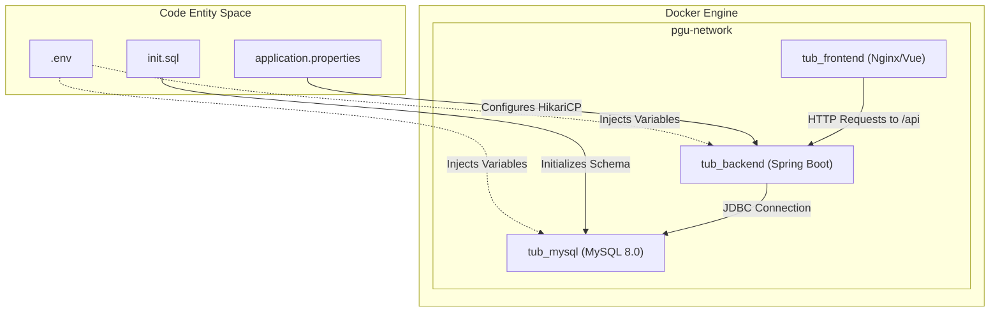
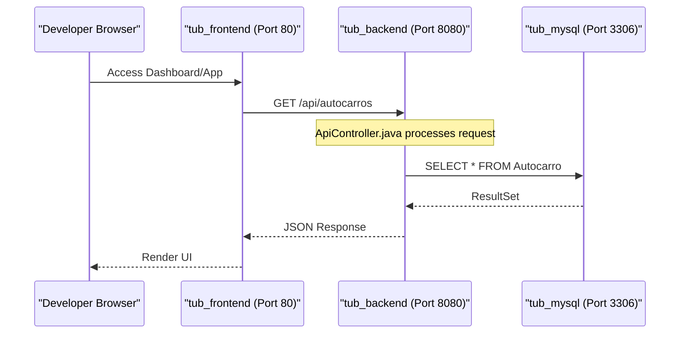

# Início Rápido e Desenvolvimento Local

Esta página fornece as instruções técnicas necessárias para configurar o projeto PGU/TUB (Plataforma de Gestão Unificada / Transportes Urbanos de Braga) num ambiente de desenvolvimento local. Cobre a estratégia de containerização, a configuração do ambiente e os procedimentos de inicialização da base de dados.

## Pré-requisitos do Projeto

Para executar a stack completa localmente, devem estar instaladas as seguintes ferramentas:
* **Docker e Docker Compose**: Para orquestrar os serviços de MySQL, Spring Boot e Vue.js.
* **Java 17+ (Opcional)**: Apenas necessário se executar o backend fora do Docker para depuração.
* **Node.js 18+ (Opcional)**: Apenas necessário se executar o frontend fora do Docker para desenvolvimento.

## Configuração do Ambiente Local

O projeto utiliza um ficheiro `docker-compose.yml` para gerir a arquitetura de três camadas: uma base de dados MySQL 8.0, um backend Java em Spring Boot e uma SPA Vue.js no frontend.

### 1. Configuração do Ambiente
Antes de iniciar os serviços, é necessário configurar as variáveis de ambiente. O sistema fornece um ficheiro de exemplo em `backend_java/.env.example` [backend_java/.env.example:1-30]().

1. Crie um ficheiro `.env` na diretoria raiz e/ou na diretoria `backend_java/`.
2. O ficheiro `.gitignore` está configurado para impedir que estes ficheiros sejam submetidos ao controlo de versões [ .gitignore:26-30]().
3. As variáveis principais incluem `DB_HOST`, `DB_NAME`, `DB_USER` e `DB_PASS` [backend_java/.env.example:10-19]().

### 2. Inicialização da Base de Dados
O container MySQL está configurado para inicializar automaticamente o esquema através do script `init.sql` localizado na raiz do projeto [docker-compose.yml:15-15](). Este script cria as tabelas necessárias (Autocarro, Linha, Paragem, etc.) e popula-as com dados iniciais (seed).

### 3. Orquestração com Docker Compose
O `docker-compose.yml` define uma rede do tipo bridge chamada `pgu-network` para permitir a comunicação entre serviços usando os nomes dos containers como hostnames [docker-compose.yml:47-49]().

| Serviço | Nome do Container | Porta Interna | Porta Externa | Função |
| :--- | :--- | :--- | :--- | :--- |
| **mysql** | `tub_mysql` | 3306 | 3306 | Armazenamento persistente [docker-compose.yml:4-18]() |
| **backend** | `tub_backend` | 8080 | 8080 | Spring Boot API [docker-compose.yml:20-33]() |
| **frontend** | `tub_frontend` | 80 | 80 | Vue.js SPA [docker-compose.yml:35-44]() |

**Comandos:**
```bash
# Compilar e iniciar todos os serviços em modo destacado
docker-compose up --build -d

# Ver os logs do backend
docker logs -f tub_backend
```

**Fontes:**
- `docker-compose.yml:1-51`
- `backend_java/.env.example:1-30`
- `.gitignore:26-30`

## Detalhes de Configuração do Backend

A aplicação Spring Boot utiliza o ficheiro `application.properties` para mapear variáveis de ambiente para a sua configuração interna, em particular para o pool de ligações HikariCP [backend_java/src/main/resources/application.properties:1-12]().

### Mapeamento da Data Source
O backend liga-se ao serviço de base de dados utilizando o URL interno da rede Docker: `jdbc:mysql://mysql:3306/tub` [docker-compose.yml:27-27](). Quando executado localmente sem Docker, o valor por omissão é `localhost` [backend_java/src/main/resources/application.properties:2-2]().

### Dependências e Fluxo dos Serviços
O diagrama seguinte ilustra como o ambiente de desenvolvimento local mapeia as entidades de código para a infraestrutura de execução.

**Infraestrutura de Runtime do Desenvolvimento**


#### 💡 Explicação da Infraestrutura de Runtime do Desenvolvimento
* **Explicação Simplória (Para Entender):**
  Este gráfico mostra como o nosso ecossistema corre dentro do computador do programador. O **Docker Engine** funciona como uma bolha isolada que divide a nossa aplicação em 3 caixas (containers): o frontend (o site), o backend (o motor Java) e a base de dados MySQL. Em baixo, mostramos os ficheiros de texto do código (como o `.env` com as passwords e o `init.sql` com as tabelas) que são usados para ligar e configurar cada uma dessas caixas de forma automática.
* **Explicação Técnica e Específica:**
  Especificação da topologia de execução do ambiente de desenvolvimento orquestrada via Docker Compose. Os três containers residem na rede bridge isolada `pgu-network`. O container `tub_mysql` é provisionado com o script `init.sql` para seeding inicial. O container `tub_backend` recebe injeção dinâmica de variáveis de ambiente a partir do ficheiro `.env` e configura a sua ligação JDBC usando o pool HikariCP mapeado no `application.properties`. As requisições HTTP do frontend são direcionadas à API REST, que por sua vez acede de forma segura ao MySQL.

**Fontes:**
- `docker-compose.yml:20-44`
- `backend_java/src/main/resources/application.properties:1-12`
- `backend_java/.env.example:1-25`

## Comunicação entre Serviços e Portas

Uma vez que o ambiente esteja a correr, os serviços ficam acessíveis nos seguintes endpoints:

* **Frontend (PWA e Backoffice)**: `http://localhost:80`
* **Backend API**: `http://localhost:8080/api`
* **Base de Dados**: `localhost:3306` (com as credenciais root/tub_user)

### Configuração Interna do Backend
O backend está configurado para registar logs no nível `DEBUG` para o pacote `pt.uminho.dai.pgu` do projeto, de forma a facilitar a deteção de problemas locais [backend_java/src/main/resources/application.properties:16-16](). As definições de segurança estão reforçadas para evitar a exposição de stack traces nas respostas de erro [backend_java/src/main/resources/application.properties:21-24]().

**Interação Local entre Componentes**


#### 💡 Explicação da Interação Local entre Componentes
* **Explicação Simplória (Para Entender):**
  Este diagrama de sequência detalha os bastidores de quando carregas num botão do site.
  1. O teu browser liga-se ao site no porto 80 (`tub_frontend`).
  2. O site envia uma chamada para a API no porto 8080 (`GET /api/autocarros`).
  3. O backend em Java recebe o pedido, cria uma query SQL (`SELECT * FROM Autocarro`) e pergunta à base de dados no porto 3306.
  4. A base de dados responde ao Java, que converte a tabela em formato de texto JSON e envia de volta ao site, desenhando os dados no teu ecrã.
* **Explicação Técnica e Específica:**
  Ciclo de processamento síncrono *request-response* no ambiente Docker local. O browser inicia a navegação na SPA hospedada no Nginx. A aplicação Vue 3 dispara um pedido HTTP `GET` assíncrono para a rota `/api/autocarros`. O `ApiController` processa a rota e solicita a listagem. A persistência aciona uma instrução SQL `SELECT` sobre a ligação JDBC no porto 3306 do `tub_mysql`, que retorna o `ResultSet`. O controlador serializa os objetos em JSON, enviando de volta a resposta HTTP 200 para renderização dinâmica no browser do utilizador.

**Fontes:**
- `backend_java/src/main/resources/application.properties:14-25`
- `docker-compose.yml:24-25`
- `docker-compose.yml:39-40`

## Resolução de Problemas no Setup Local

1. **Ligação à Base de Dados Recusada**: Garanta que o serviço `mysql` está saudável antes de o `backend` arrancar. O serviço `backend` inclui uma cláusula `depends_on` [docker-compose.yml:30-31](), mas a base de dados pode demorar alguns segundos a executar `init.sql`.
2. **Conflitos de Porta**: Se as portas 80, 8080 ou 3306 já estiverem em uso na máquina anfitriã, altere o lado esquerdo do mapeamento `ports` em `docker-compose.yml` [docker-compose.yml:13, 25, 40]().
3. **Erros 404**: O frontend inclui um `NotFoundView.vue` para tratar rotas inválidas dentro da SPA [frontend_vue/src/views/NotFoundView.vue:1-30](). Se o vir, verifique a configuração do Vue Router.

**Fontes:**
- `docker-compose.yml:1-51`
- `frontend_vue/src/views/NotFoundView.vue:8-30`
