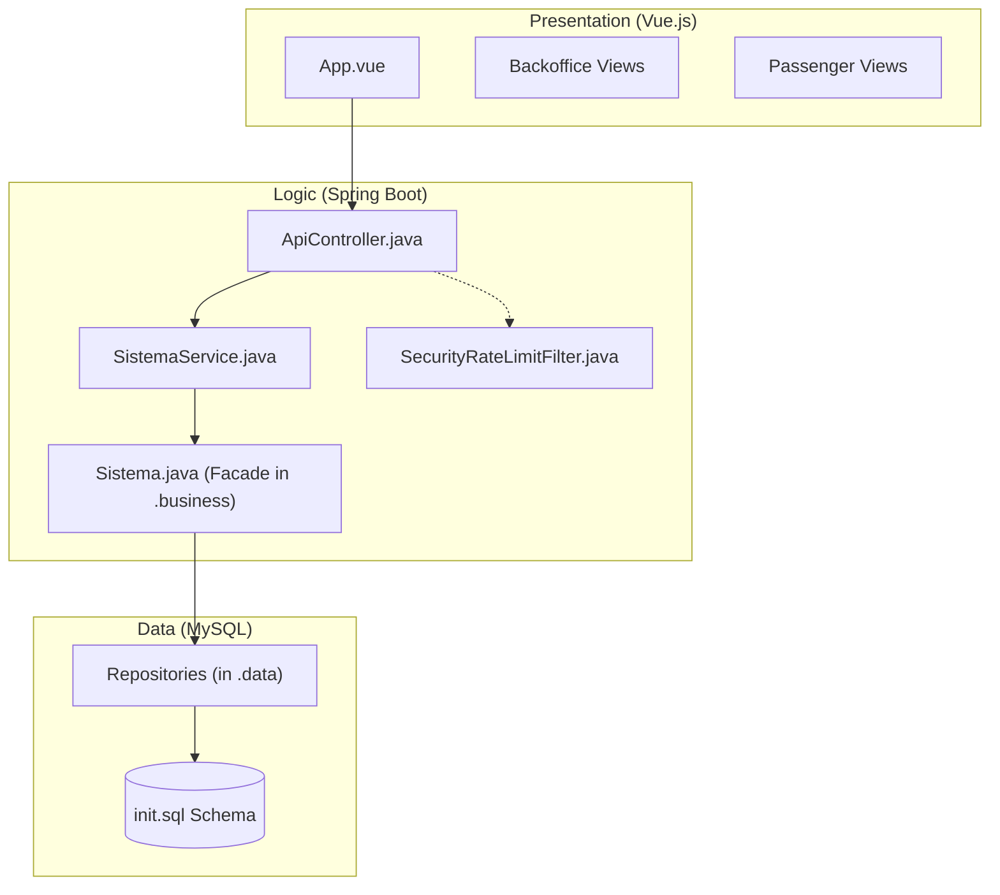
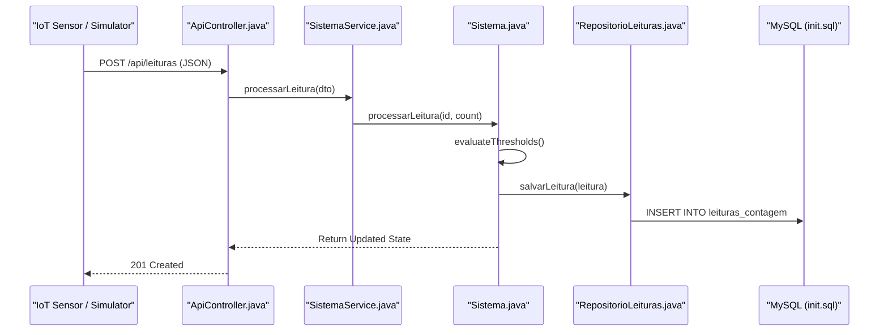
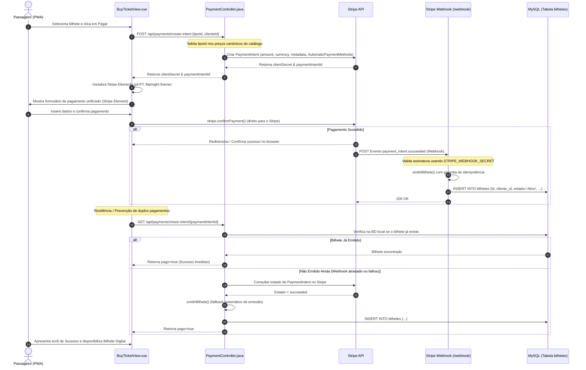

# Arquitetura do Sistema e Fluxo de Dados

Esta página detalha a arquitetura técnica do sistema PGU (Plataforma de Gestão Unificada) para os Transportes Urbanos de Braga (TUB). O sistema é construído com base numa arquitetura de três camadas, concebida para tratar, em tempo real, dados de sensores IoT, processar a lógica de negócio para a gestão da frota e servir interfaces distintas para operadores e passageiros.

## Arquitetura de Três Camadas

O sistema segue uma arquitetura em camadas mapeada pelo **método 4SRS**, garantindo uma separação clara entre apresentação, lógica e persistência de dados [README.md:9-16]().

### 1. Camada de Apresentação (P5 — UI)
Uma Single Page Application (SPA) em Vue.js 3 que funciona como Progressive Web App (PWA). Disponibiliza duas interfaces principais:
* **Backoffice:** Painel para operadores de frota monitorizarem KPIs, localizações dos autocarros em tempo real e correlações de lotação [README.md:20-20]().
* **Aplicação do Passageiro:** Interface mobile-first para planeamento de viagens, mapas em tempo real e bilhética [README.md:21-21]().

### 2. Camada de Lógica de Negócio (P2 — Logic)
Uma aplicação Spring Boot que atua como motor central. Trata de:
* **Ingestão IoT:** Processamento das leituras de sensores recebidas dos veículos [README.md:99-99]().
* **Motor de Domínio:** A classe `Sistema` funciona como fachada principal, gerindo o estado dos autocarros (`Autocarro`), das linhas (`Linha`) e dos alertas (`Alerta`) [backend_java/src/main/java/pt/uminho/dai/pgu/api/SpringConfig.java:20-46]().
* **Segurança:** Autenticação para administradores (restrita a domínios `@uminho.pt`) e para passageiros [README.md:111-115]().

### 3. Camada de Dados (P7 — Data)
Uma base de dados MySQL (implantada via Azure Flexible Server) que persiste o estado do sistema usando o padrão Repository sobre JDBC [README.md:15-15]().

### Diagrama de Mapeamento de Componentes
O diagrama seguinte liga a arquitetura de al**Mapeamento Arquitetura para Código**

#### 💡 Explicação do Diagrama de Mapeamento de Componentes
* **Explicação Simplória (Para Entender):**
  Este diagrama mostra como os ficheiros de código reais se encaixam na nossa arquitetura. Imagina isto como um serviço de correio: a aplicação Vue no teu browser (a carta que o utilizador escreve) é enviada para a central de correio `ApiController`. A central passa a carta ao gerente `SistemaService` que a traduz para o cérebro do sistema (`Sistema.java` localizado na pasta `business`). Este cérebro atualiza as regras lógicas e, se necessário, manda os arquivistas (os Repositórios na pasta `data`) guardarem ou lerem a informação nas prateleiras físicas da base de dados MySQL.
* **Explicação Técnica e Específica:**
  Mapeamento de implementação física da arquitetura de 3 camadas da PGU/TUB. A camada de apresentação (Vue.js 3 SPA) realiza chamadas HTTP assíncronas para o `ApiController` (que é filtrado pelo `SecurityRateLimitFilter` para controlo de tráfego). O controller delega no padrão *Application Service* (`SistemaService.java`) que atua como orquestrador do Spring. Este comunica com a fachada de domínio `Sistema.java` (no pacote `pt.uminho.dai.pgu.business`), contendo toda a lógica de negócio pura (P2). Por fim, o domínio comunica com os componentes de persistência JDBC e repositórios (no pacote `pt.uminho.dai.pgu.data`) representando a camada P7, gravando o estado transacional final no MySQL.

Fontes: [README.md:17-31](), [backend_java/src/main/java/pt/uminho/dai/pgu/api/SpringConfig.java:16-17]()

## Fluxo de Dados IoT e Pipeline de Ingestão

O sistema processa dados em tempo real provenientes dos sensores dos autocarros (simulados ou reais) para fornecer atualizações de lotação e alertas em direto. Este fluxo segue uma pipeline de Arquitetura Orientada a Eventos (EDA) com 4 etapas [tools/simulador_sensores.html:6-7]().

### Sequência de Ingestão
1. **Leitura do Sensor:** O sensor gera um payload JSON contendo o ID do veículo e a contagem de passageiros.
2. **Entrada na API:** O `ApiController` recebe um pedido `POST` em `/api/leituras` [README.md:99-99]().
3. **Processamento:** A classe `Sistema` processa a leitura através de `processarLeitura()`, atualizando a instância específica de `Autocarro` [README.md:77-79]().
4. **Avaliação de Limiares:** O sistema verifica se a nova lotação ultrapassa os `ThresholdsAlerta` definidos.
5. **Persistência e Notificação:** Os dados são guardados na tabela `LeituraContagem` e, em caso de violação de limiar, é gerado um novo `Alerta` [README.md:101-101]().

**Pipeline de Ingestão de Dados**

#### 💡 Explicação da Sequência de Ingestão de Dados IoT
* **Explicação Simplória (Para Entender):**
  Este gráfico de sequência detalha a linha de montagem das leituras de passageiros. O sensor do autocarro (ou simulador) bate à porta da nossa API (`POST /api/leituras`). O controlador atende e passa o pacote ao `SistemaService`, que o entrega ao cérebro do sistema (`Sistema.java`). O cérebro faz um exame rápido: "Este autocarro está cheio demais? Há leituras anómalas?" (`evaluateThresholds()`). Depois de tirar conclusões, entrega a leitura ao repositório de dados, que entra na base de dados e faz um `INSERT` para gravar as contagens. Por fim, respondemos de volta com um sinal verde "201 Created" confirmando que o autocarro foi processado com sucesso.
* **Explicação Técnica e Específica:**
  Diagrama de interação UML para o pipeline de processamento assíncrono de telemetria IoT. O sensor físico realiza um `POST` contendo as entradas/saídas e o timestamp em formato JSON. O `ApiController` processa a desserialização e delega em `SistemaService.java`. A chamada síncrona invoca o método de negócio `processarLeitura()` em `Sistema.java` (camada de domínio/business). A classe avalia os limites dinâmicos através da injeção de dependência de `ThresholdsAlerta`. Em seguida, o `RepositorioLeituras` (camada de persistência/data) executa um insert parametrizado via JDBC na base de dados. O estado atualizado da frota é retornado na resposta HTTP para otimização de latência.

## Processo de Pagamento Integrado (Stripe)

O sistema de bilhética digital da PGU/TUB utiliza uma integração segura com a API do **Stripe** de ponta-a-ponta, assegurando a conformidade com as diretivas PCI-DSS ao processar dados de cartões diretamente do browser através de **Stripe Payment Elements** com suporte para múltiplos meios de pagamento automáticos (incluindo Cartões, MB WAY, Revolut Pay, Link e Bancontact) [backend_java/src/main/java/pt/uminho/dai/pgu/api/PaymentController.java:28-38]().

### Fluxo de Pagamento e Resiliência
Para garantir a máxima fiabilidade, evitar duplos pagamentos e suportar situações em que a ligação de rede do passageiro falha a meio da transação ou o utilizador navega para trás, o sistema implementa um fluxo em 3 etapas com verificação ativa de estado:
1. **Intenção de Compra**: O passageiro escolhe o bilhete e o backend cria um `PaymentIntent` no Stripe com o montante fixado pelos preços canónicos (nunca confiando no preço enviado pelo frontend) [backend_java/src/main/java/pt/uminho/dai/pgu/api/PaymentController.java:45-50]().
2. **Confirmação e Webhook**: O browser envia os dados diretamente para o Stripe. Ao confirmar-se o sucesso, o Stripe notifica assincronamente o backend via **Webhook** assinado (`payment_intent.succeeded`), que de forma idêntica e segura regista o bilhete na base de dados [backend_java/src/main/java/pt/uminho/dai/pgu/api/PaymentController.java:113-147]().
3. **Resiliência Ativa (`check-intent`)**: Quando o frontend recarrega ou o utilizador é redirecionado, a app chama o endpoint `/api/payments/check-intent/{id}`. Este verifica primeiro a BD local (se o webhook já tiver persistido a compra). Se ainda não estiver registado, consulta diretamente a API do Stripe em tempo real (como fallback resiliente) para obter o estado oficial da transação e emitir o bilhete caso esta tenha sido bem sucedida [backend_java/src/main/java/pt/uminho/dai/pgu/api/PaymentController.java:160-213]().

**Diagrama de Sequência do Processo de Pagamento Stripe**

#### 💡 Explicação do Processo de Pagamento Stripe
* **Explicação Simplória (Para Entender):**
  Este grande diagrama mostra o processo super seguro de comprar um bilhete digital. 
  1. Primeiro, avisas o backend Java que queres comprar um bilhete. O backend cria uma "Intenção de Compra" oficial no Stripe e recebe uma chave secreta.
  2. O ecrã do telemóvel desenha o formulário seguro do Stripe. Inseres os teus dados de pagamento e envias-nos diretamente para o Stripe (não passam pelos nossos servidores, garantindo segurança total).
  3. Assim que pagas, o Stripe avisa o nosso backend por uma porta traseira segura chamada "Webhook", que grava o bilhete na base de dados.
  4. Se o teu telemóvel perder rede durante a compra, a nossa aplicação Vue faz uma verificação dupla inteligente (`check-intent`). Ela pergunta ao backend "Já temos o pagamento?" Se sim, emite o bilhete. Se o webhook tiver falhado ou atrasado, o backend vai ao próprio Stripe perguntar o estado e emite o bilhete na hora. Isto evita que o cliente pague e fique sem bilhete!
* **Explicação Técnica e Específica:**
  Fluxo de integração assíncrona, idempotente e em conformidade com as diretivas PCI-DSS. O `PaymentController` inicia a transação instanciando um `PaymentIntent` na API do Stripe usando preços definidos no backend para evitar adulteração de valores no cliente (*client-side tamperings*). O Stripe retorna o `clientSecret` para inicializar com segurança o *Stripe Elements* no Vue.js. Após a confirmação síncrona do lado do cliente com `stripe.confirmPayment()`, o Stripe dispara um evento assíncrono `payment_intent.succeeded` para o nosso endpoint de Webhook. Este valida a assinatura SHA256 usando o segredo de webhook e invoca `emitirBilhete()` de forma idempotente para persistir a compra no MySQL. O mecanismo de resiliência `/check-intent` atua como fallback em tempo real, mitigando cenários de quebra de ligação (*network partition*) no cliente.

Fontes: [backend_java/src/main/java/pt/uminho/dai/pgu/api/PaymentController.java:28-60](), [frontend_vue/src/views/passenger/BuyTicketView.vue:4-41]()

## Inicialização e Configuração do Sistema

O estado do sistema é inicializado durante o arranque do Spring Boot, no ficheiro `SpringConfig.java`. Esta configuração regista o bean `Sistema` e popula-o com dados realistas da frota e da rede TUB [backend_java/src/main/java/pt/uminho/dai/pgu/api/SpringConfig.java:19-22]().

### Entidades Inicializadas
| Tipo de Entidade | Exemplos no Código | Referência ao Ficheiro |
| :--- | :--- | :--- |
| **Autocarro** | `TUB-101` (Mercedes Citaro), `TUB-102` (Volvo 7900) | [backend_java/src/main/java/pt/uminho/dai/pgu/api/SpringConfig.java:24-30]() |
| **Linha** | `L7` (Celeirós), `L40` (Gualtar), `L43` (Estação) | [backend_java/src/main/java/pt/uminho/dai/pgu/api/SpringConfig.java:32-34]() |
| **Associações** | `TUB-101` -> `L7`, `TUB-104` -> `L40` | [backend_java/src/main/java/pt/uminho/dai/pgu/api/SpringConfig.java:37-42]() |

## Mapeamento 4SRS para Componentes

O método 4SRS (System Requirements Specification Strategy) é usado para mapear requisitos funcionais em componentes arquiteturais [README.md:9-10]().

* **P2 (Lógica de Negócio):** Representada pelo pacote `pt.uminho.dai.pgu.business`. Encapsula as regras de domínio centralizadas na fachada `Sistema.java` e nos modelos.
* **P5 (Interface de Utilizador):** Representada pela diretoria `frontend_vue/src/views`, separando vistas de operador e de passageiro.
* **P7 (Persistência de Dados):** Representada pelo pacote `pt.uminho.dai.pgu.data` contendo os repositórios JDBC e a inicialização de base de dados.

Fontes: [README.md:9-16](), [backend_java/src/main/java/pt/uminho/dai/pgu/api/SpringConfig.java:1-17]()

