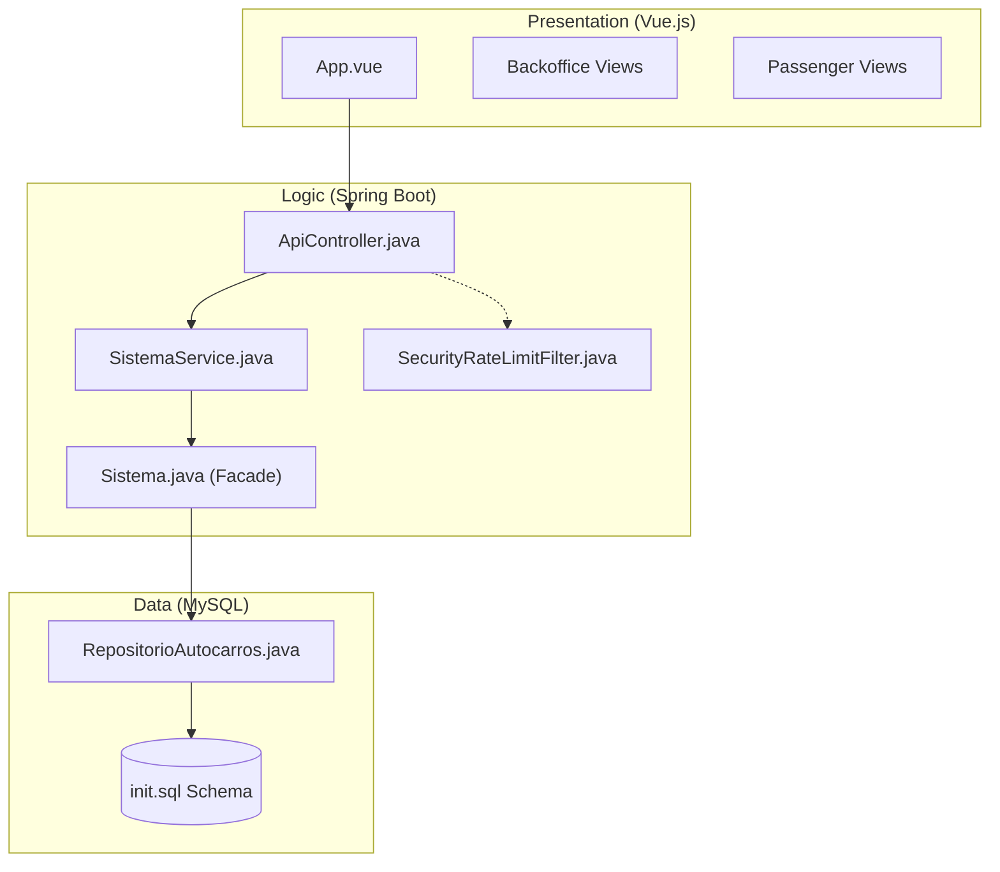
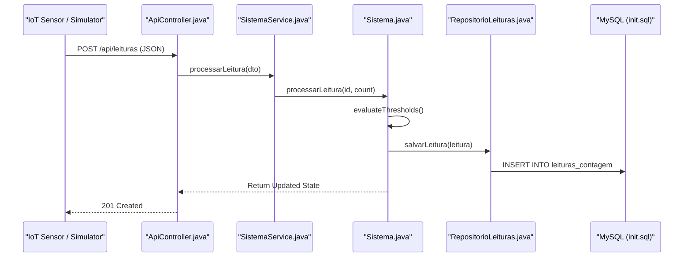

# Arquitetura do Sistema e Fluxo de Dados

Esta página detalha a arquitetura técnica do sistema PGU (Plataforma de Gestão Unificada) para os Transportes Urbanos de Braga (TUB). O sistema é construído com base numa arquitetura de três camadas, concebida para tratar, em tempo real, dados de sensores IoT, processar a lógica de negócio para a gestão da frota e servir interfaces distintas para operadores e passageiros.

## Arquitetura de Três Camadas

O sistema segue uma arquitetura em camadas mapeada pelo **método 4SRS**, garantindo uma separação clara entre apresentação, lógica e persistência de dados [README.md:9-16]().

### 1. Camada de Apresentação (P5 — UI)
Uma Single Page Application (SPA) em Vue.js 3 que funciona como Progressive Web App (PWA). Disponibiliza duas interfaces principais:
*   **Backoffice:** Painel para operadores de frota monitorizarem KPIs, localizações dos autocarros em tempo real e correlações de lotação [README.md:20-20]().
*   **Aplicação do Passageiro:** Interface mobile-first para planeamento de viagens, mapas em tempo real e bilhética [README.md:21-21]().

### 2. Camada de Lógica de Negócio (P2 — Logic)
Uma aplicação Spring Boot que atua como motor central. Trata de:
*   **Ingestão IoT:** Processamento das leituras de sensores recebidas dos veículos [README.md:99-99]().
*   **Motor de Domínio:** A classe `Sistema` funciona como fachada principal, gerindo o estado dos autocarros (`Autocarro`), das linhas (`Linha`) e dos alertas (`Alerta`) [backend_java/src/main/java/pt/uminho/dai/pgu/api/SpringConfig.java:20-46]().
*   **Segurança:** Autenticação para administradores (restrita a domínios `@uminho.pt`) e para passageiros [README.md:111-115]().

### 3. Camada de Dados (P7 — Data)
Uma base de dados MySQL (implantada via Azure Flexible Server) que persiste o estado do sistema usando o padrão Repository sobre JDBC [README.md:15-15]().

### Diagrama de Mapeamento de Componentes
O diagrama seguinte liga a arquitetura de alto nível às entidades de código específicas.

**Mapeamento Arquitetura para Código**

Fontes: [README.md:17-31](), [backend_java/src/main/java/pt/uminho/dai/pgu/api/SpringConfig.java:16-17]()

## Fluxo de Dados IoT e Pipeline de Ingestão

O sistema processa dados em tempo real provenientes dos sensores dos autocarros (simulados ou reais) para fornecer atualizações de lotação e alertas em direto. Este fluxo segue uma pipeline de Arquitetura Orientada a Eventos (EDA) com 4 etapas [tools/simulador_sensores.html:6-7]().

### Sequência de Ingestão
1.  **Leitura do Sensor:** O sensor gera um payload JSON contendo o ID do veículo e a contagem de passageiros.
2.  **Entrada na API:** O `ApiController` recebe um pedido `POST` em `/api/leituras` [README.md:99-99]().
3.  **Processamento:** A classe `Sistema` processa a leitura através de `processarLeitura()`, atualizando a instância específica de `Autocarro` [README.md:77-79]().
4.  **Avaliação de Limiares:** O sistema verifica se a nova lotação ultrapassa os `ThresholdsAlerta` definidos.
5.  **Persistência e Notificação:** Os dados são guardados na tabela `LeituraContagem` e, em caso de violação de limiar, é gerado um novo `Alerta` [README.md:101-101]().

**Pipeline de Ingestão de Dados**

Fontes: [README.md:91-109](), [tools/simulador_sensores.html:1-7](), [backend_java/src/main/java/pt/uminho/dai/pgu/api/SpringConfig.java:20-22]()

## Inicialização e Configuração do Sistema

O estado do sistema é inicializado durante o arranque do Spring Boot, no ficheiro `SpringConfig.java`. Esta configuração regista o bean `Sistema` e popula-o com dados realistas da frota e da rede TUB [backend_java/src/main/java/pt/uminho/dai/pgu/api/SpringConfig.java:19-22]().

### Entidades Inicializadas
| Tipo de Entidade | Exemplos no Código | Referência ao Ficheiro |
| :--- | :--- | :--- |
| **Autocarro** | `TUB-101` (Mercedes Citaro), `TUB-102` (Volvo 7900) | [backend_java/src/main/java/pt/uminho/dai/pgu/api/SpringConfig.java:24-30]() |
| **Linha** | `L7` (Celeirós), `L40` (Gualtar), `L43` (Estação) | [backend_java/src/main/java/pt/uminho/dai/pgu/api/SpringConfig.java:32-34]() |
| **Associações** | `TUB-101` -> `L7`, `TUB-104` -> `L40` | [backend_java/src/main/java/pt/uminho/dai/pgu/api/SpringConfig.java:37-42]() |

## Mapeamento 4SRS para Componentes

O método 4SRS (System Requirements Specification Strategy) é usado para mapear requisitos funcionais em componentes arquiteturais [README.md:9-10]().

*   **P2 (Lógica de Negócio):** Representada pelo pacote `pt.uminho.dai.pgu.services`. Encapsula o "Motor de Ingestão" e o "Motor de Correlação" centrais [README.md:77-77]().
*   **P5 (Interface de Utilizador):** Representada pela diretoria `frontend_vue/src/views`, separando vistas de operador e de passageiro [README.md:80-81]().
*   **P7 (Persistência de Dados):** Representada pelo pacote `pt.uminho.dai.pgu.repositories` e pelo esquema `init.sql` [README.md:78-78](), [README.md:87-87]().

Fontes: [README.md:9-16](), [backend_java/src/main/java/pt/uminho/dai/pgu/api/SpringConfig.java:1-17]()
