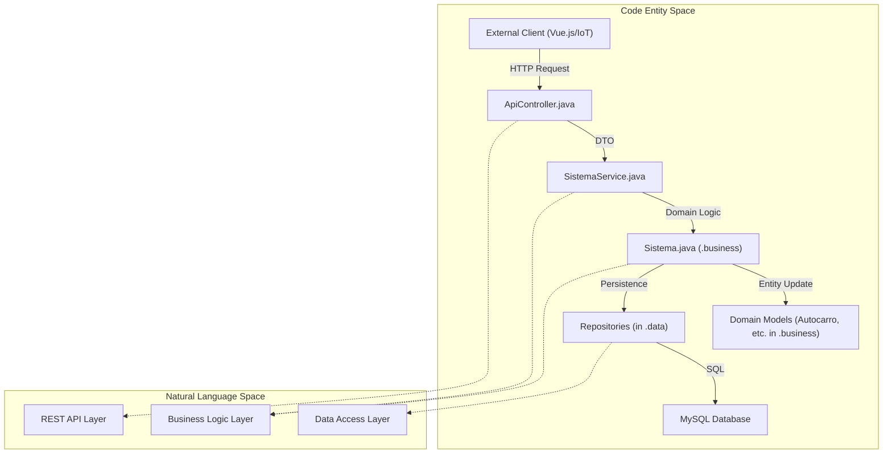

# Backend — Spring Boot API

O backend PGU/TUB é um serviço web em Java construído sobre **Spring Boot 3.2.4** [backend_java/pom.xml:9-9](). Funciona como o orquestrador central da plataforma, gerindo a ingestão em tempo real de dados de sensores IoT, a autenticação de passageiros e administradores e a monitorização do estado da frota. O sistema segue uma arquitetura em camadas para separar responsabilidades entre o tratamento de HTTP, a lógica de negócio e a persistência.

### Camadas Arquiteturais e Estrutura de Pacotes

O backend está organizado em três pacotes lógicos principais na raiz `pt.uminho.dai.pgu` que refletem perfeitamente a arquitetura de 3 camadas mapeada no 4SRS (Presentation, business/P2 e data/P7):

| Camada | Pacote | Responsabilidade |
| :--- | :--- | :--- |
| **API (Apresentação)** | `pt.uminho.dai.pgu.api` | Controladores REST, configuração global do Spring Boot, filtros de segurança e tratamento de exceções. |
| **Business (P2: Lógica)** | `pt.uminho.dai.pgu.business` | Lógica de negócio, entidades de domínio (`Autocarro`, `Cliente`, etc.) e serviços core de controlo (Fachada principal `Sistema.java`). |
| **Data (P7: Persistência)** | `pt.uminho.dai.pgu.data` | Persistência de dados, implementações de repositórios JDBC (ex: `RegistoViagemRepository.java`) e gestão de ligações SQL. |

Para mais detalhes sobre o ponto de entrada principal do servidor, consulte **`pt.uminho.dai.pgu.Programa`** (localizado agora na raiz de pacotes para permitir component scan automático do Spring Boot) [backend_java/pom.xml:59-59]().

### Diagrama de Interação entre Componentes

O diagrama seguinte ilustra como um pedido percorre o sistema, desde a chamada REST externa até à persistência na base de dados.

**Fluxo de Pedidos no Backend**

#### 💡 Explicação do Fluxo de Pedidos no Backend
* **Explicação Simplória (Para Entender):**
  Este diagrama mostra a estrada pela qual a informação viaja dentro do nosso servidor. Quando um utilizador faz um clique no telemóvel (ex: pede para ver os autocarros) ou um sensor envia dados, um pedido HTTP bate à porta do `ApiController`. O controlador valida o pedido usando pacotes de dados básicos (DTOs) e entrega-o ao `SistemaService`. Este, por sua vez, fala com o cérebro da aplicação (`Sistema.java`) que decide o que fazer, atualiza os dados dos autocarros e chama o repositório de dados para escrever as alterações no banco de dados MySQL final.
* **Explicação Técnica e Específica:**
  Fluxo de controlo síncrono e arquitetura desacoplada no Spring Boot. O cliente HTTP dispara um pedido para a camada REST (`api`). O `ApiController` mapeia o pedido e delega para o `SistemaService` (padrão Application Service). Este orquestra a chamada de negócio invocando a fachada de domínio `Sistema.java` (localizada no pacote `business`), que realiza as transações lógicas sobre as entidades e modelos (como `Autocarro` e `Cliente`). A persistência é concretizada via JDBC pelos Repositórios (no pacote `data`), que efetuam instruções SQL nativas sobre o MySQL Flexible Server na Cloud Azure.

**Fontes:** [backend_java/src/main/java/pt/uminho/dai/pgu/api/SpringConfig.java:1-61](), [backend_java/pom.xml:23-50]()

### Configuração Spring e Injeção de Dependências

O sistema utiliza `SpringConfig.java` para gerir o ciclo de vida dos componentes principais e dos beans de segurança.

* **Gestão de Beans**: A classe `Sistema`, que atua como fachada do domínio, é registada como Singleton Bean [backend_java/src/main/java/pt/uminho/dai/pgu/api/SpringConfig.java:19-46]().
* **Estado Inicial**: No arranque, o sistema pré-carrega uma frota TUB realista (por exemplo, "TUB-101" a "TUB-106") e rotas (L7, L40, L43) na instância `Sistema` [backend_java/src/main/java/pt/uminho/dai/pgu/api/SpringConfig.java:24-42]().
* **Política de CORS**: Configurada para permitir todas as origens (`*`) e os métodos standard (`GET`, `POST`, `PUT`, `DELETE`), facilitando a comunicação com o frontend Vue.js [backend_java/src/main/java/pt/uminho/dai/pgu/api/SpringConfig.java:54-60]().
* **Beans de Segurança**: É disponibilizado um `BCryptPasswordEncoder` para o hashing seguro de credenciais [backend_java/src/main/java/pt/uminho/dai/pgu/api/SpringConfig.java:49-51]().

**Fontes:** [backend_java/src/main/java/pt/uminho/dai/pgu/api/SpringConfig.java:16-61]()

### Páginas Filhas

Para análises detalhadas de componentes específicos do backend, consulte as páginas seguintes:

* **[Controlador REST e DTOs](04-Controlador-REST-e-DTOs.md)**: Referência para todos os endpoints `/api` e os Data Transfer Objects usados na validação.
* **[Lógica de Negócio — Sistema e SistemaService](05-Logica-de-Negocio.md)**: Detalhes sobre a fachada `Sistema` e como esta processa lotação e alertas.
* **[Modelos de Domínio](06-Modelos-de-Dominio.md)**: Referência técnica para entidades como `Autocarro`, `Linha` e `LeituraContagem`.
* **[Camada de Dados — Repositórios e Base de Dados](07-Camada-de-Dados.md)**: Detalhes de implementação dos repositórios JDBC e do esquema MySQL.
* **[Segurança — Rate Limiting e Autenticação](08-Seguranca.md)**: Documentação sobre proteção contra ataques de força bruta e restrições de domínio para administradores.

### Contexto de Deployment

O backend é compilado num ficheiro `app.jar` usando Maven [backend_java/pom.xml:53-53]() e implantado em Azure Web Apps (`backend-pgu-tub-2026`) através de GitHub Actions [.github/workflows/deploy_azure.yml:26-31](). Requer um runtime Java 17 [.github/workflows/deploy_azure.yml:15-19]().

**Fontes:** [.github/workflows/deploy_azure.yml:9-32](), [backend_java/pom.xml:17-21]()
