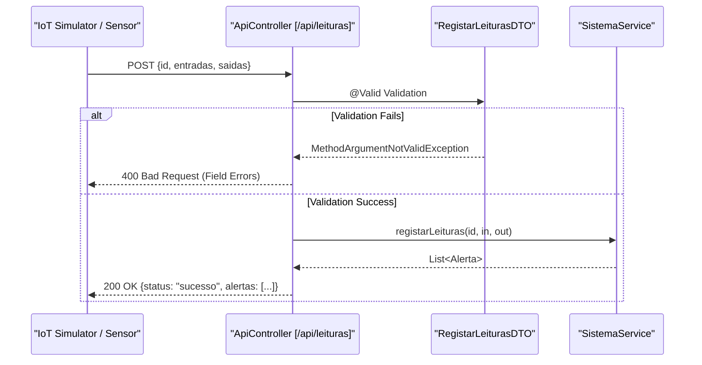

# Controlador REST e DTOs

O `ApiController` é o ponto de entrada principal do backend PGU/TUB, expondo uma interface RESTful sob o prefixo `/api` [backend_java/src/main/java/pt/uminho/dai/pgu/api/ApiController.java:31-32](). Implementa uma estratégia de validação **Zero-Trust**, em que todos os pedidos recebidos são validados de forma estrita usando Data Transfer Objects (DTOs) e Jakarta Bean Validation antes de chegarem à camada de serviço [backend_java/src/main/java/pt/uminho/dai/pgu/api/ApiController.java:41-46]().

## Arquitetura e Fluxo de Dados

O controlador delega a lógica de negócio para o `SistemaService` [backend_java/src/main/java/pt/uminho/dai/pgu/api/ApiController.java:34-38](). O fluxo segue um padrão standard Request-DTO-Service-Model.

### Fluxo de Processamento de Pedidos
1. **Receção do Pedido**: O `ApiController` recebe um payload JSON.
2. **Validação do DTO**: As anotações Jakarta (por exemplo, `@Valid`, `@NotBlank`) são avaliadas [backend_java/src/main/java/pt/uminho/dai/pgu/api/ApiController.java:46]().
3. **Tratamento de Erros**: Se a validação falhar, `handleValidationErrors` apanha a `MethodArgumentNotValidException` e devolve uma resposta estruturada `400 Bad Request` [backend_java/src/main/java/pt/uminho/dai/pgu/api/ApiController.java:65-80]().
4. **Execução do Serviço**: Os dados validados são entregues ao `SistemaService`.

**Diagrama de Fluxo de Dados: Leitura IoT até Resposta de Alerta**
Este diagrama ilustra como uma leitura de sensor IoT flui de `RegistarLeiturasDTO`, através do `ApiController`, até à lógica central.


**Fontes:** [backend_java/src/main/java/pt/uminho/dai/pgu/api/ApiController.java:82-94](), [backend_java/src/main/java/pt/uminho/dai/pgu/api/dto/RegistarLeiturasDTO.java:8-27]()

---

## Referência dos Endpoints REST

### Gestão de Frota e Infraestrutura
| Method | Endpoint | DTO / Payload | Descrição |
|:---|:---|:---|:---|
| `POST` | `/autocarros` | `RegistarAutocarroDTO` | Regista um novo veículo com capacidade e matrícula [backend_java/src/main/java/pt/uminho/dai/pgu/api/ApiController.java:45-59](). |
| `GET` | `/autocarros` | N/A | Lista todos os autocarros registados [backend_java/src/main/java/pt/uminho/dai/pgu/api/ApiController.java:108-116](). |
| `GET` | `/autocarros/{id}` | N/A | Estado detalhado de um autocarro específico [backend_java/src/main/java/pt/uminho/dai/pgu/api/ApiController.java:96-106](). |
| `POST` | `/linhas` | `RegistarLinhaDTO` | Cria uma nova linha de transporte [backend_java/src/main/java/pt/uminho/dai/pgu/api/ApiController.java:136-144](). |
| `POST` | `/linhas/{id}/paragens` | `AdicionarParagemDTO` | Adiciona uma paragem a uma linha específica [backend_java/src/main/java/pt/uminho/dai/pgu/api/ApiController.java:146-155](). |
| `POST` | `/linhas/{id}/autocarros`| `AssociarAutocarroDTO` | Atribui um autocarro para operar numa linha [backend_java/src/main/java/pt/uminho/dai/pgu/api/ApiController.java:157-165](). |

### IoT e Analítica
| Method | Endpoint | DTO / Payload | Descrição |
|:---|:---|:---|:---|
| `POST` | `/leituras` | `RegistarLeiturasDTO` | Recebe dados de sensores (entradas/saídas) e devolve os alertas despoletados [backend_java/src/main/java/pt/uminho/dai/pgu/api/ApiController.java:82-94](). |
| `GET` | `/dashboard` | N/A | KPIs agregados para o Backoffice [backend_java/src/main/java/pt/uminho/dai/pgu/api/ApiController.java:118-125](). |
| `GET` | `/historico` | N/A | Dados históricos de lotação agrupados por dia [backend_java/src/main/java/pt/uminho/dai/pgu/api/ApiController.java:127-134](). |

### Autenticação e Perfis
| Method | Endpoint | DTO / Payload | Descrição |
|:---|:---|:---|:---|
| `POST` | `/login/admin` | `AdminLoginDTO` | Login do operador (requer email @uminho.pt) [backend_java/src/main/java/pt/uminho/dai/pgu/api/dto/AdminLoginDTO.java:7-20](). |
| `POST` | `/login/cliente` | `ClienteLoginDTO` | Login do passageiro [backend_java/src/main/java/pt/uminho/dai/pgu/api/dto/ClienteLoginDTO.java:7-20](). |
| `POST` | `/signup` | `ClienteSignupDTO` | Registo de passageiro [backend_java/src/main/java/pt/uminho/dai/pgu/api/dto/ClienteSignupDTO.java:8-28](). |
| `PUT` | `/perfil` | `AtualizarPerfilDTO` | Atualiza o NIF ou o estado do passe mensal [backend_java/src/main/java/pt/uminho/dai/pgu/api/dto/AtualizarPerfilDTO.java:10-21](). |

---

## Data Transfer Objects (DTOs) e Regras de Validação

Os DTOs garantem que nenhum dado mal-formado chega à lógica de negócio. Utilizam expressões regulares para impedir ataques comuns de injeção e impor as restrições de domínio.

### Implementações de DTO Principais

#### RegistarAutocarroDTO
Usado no onboarding da frota. Reforça os formatos portugueses de matrícula e os limites físicos de capacidade.
* **Restrições**:
    * `id`: 3-20 caracteres, alfanuméricos e hífenes [backend_java/src/main/java/pt/uminho/dai/pgu/api/dto/RegistarAutocarroDTO.java:14-17]().
    * `capacidade`: 1 a 200 [backend_java/src/main/java/pt/uminho/dai/pgu/api/dto/RegistarAutocarroDTO.java:19-22]().
    * `matricula`: Regex `^[A-Z0-9]{2}-[A-Z0-9]{2}-[A-Z0-9]{2}$` [backend_java/src/main/java/pt/uminho/dai/pgu/api/dto/RegistarAutocarroDTO.java:24-27]().

#### RegistarLeiturasDTO
Usado pela pipeline IoT.
* **Restrições**:
    * `entradas`/`saidas`: 0 a 300 por leitura [backend_java/src/main/java/pt/uminho/dai/pgu/api/dto/RegistarLeiturasDTO.java:13-19]().

#### AtualizarPerfilDTO
Previne XSS armazenado restringindo o campo `nif` a caracteres numéricos e espaços [backend_java/src/main/java/pt/uminho/dai/pgu/api/dto/AtualizarPerfilDTO.java:11-13]().

**Mapeamento de Entidades de Código: DTOs de Autenticação**
Este diagrama mapeia os conceitos de "Login/Signup" em linguagem natural para classes DTO específicas e os respetivos campos de validação.

```mermaid
classDiagram
    class "AdminLoginDTO" {
        +String email (Email, NotBlank)
        +String password (Size 4-128)
    }
    class "ClienteLoginDTO" {
        +String email (Email, NotBlank)
        +String password (Size 4-128)
    }
    class "ClienteSignupDTO" {
        +String nome (Regex: Alpha-only)
        +String email (Email)
        +String password (Size 10-128)
    }
    class "AtualizarPerfilDTO" {
        +String nif (Regex: Numbers)
        +Boolean passeMensal
    }
    
    "AdminLoginDTO" --|> "ApiController" : POST /login/admin
    "ClienteLoginDTO" --|> "ApiController" : POST /login/cliente
    "ClienteSignupDTO" --|> "ApiController" : POST /signup
    "AtualizarPerfilDTO" --|> "ApiController" : PUT /perfil
```
**Fontes:** [backend_java/src/main/java/pt/uminho/dai/pgu/api/dto/AdminLoginDTO.java:7-20](), [backend_java/src/main/java/pt/uminho/dai/pgu/api/dto/ClienteLoginDTO.java:7-20](), [backend_java/src/main/java/pt/uminho/dai/pgu/api/dto/ClienteSignupDTO.java:8-28](), [backend_java/src/main/java/pt/uminho/dai/pgu/api/dto/AtualizarPerfilDTO.java:10-21]()

---

## Tratamento de Erros de Validação

O `ApiController` inclui um handler centralizado para falhas de validação. Isto garante que o frontend recebe um formato de erro consistente:

```json
{
  "status": "erro",
  "mensagem": "Dados de entrada inválidos. Verifique os campos assinalados.",
  "erros": {
    "matricula": "Formato de matrícula inválido. Use XX-XX-XX (ex: 23-AB-45).",
    "capacidade": "A capacidade máxima permitida é 200."
  }
}
```
**Fontes:** [backend_java/src/main/java/pt/uminho/dai/pgu/api/ApiController.java:65-80]()
