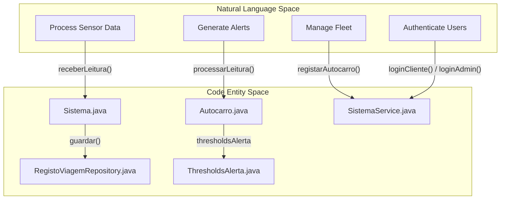
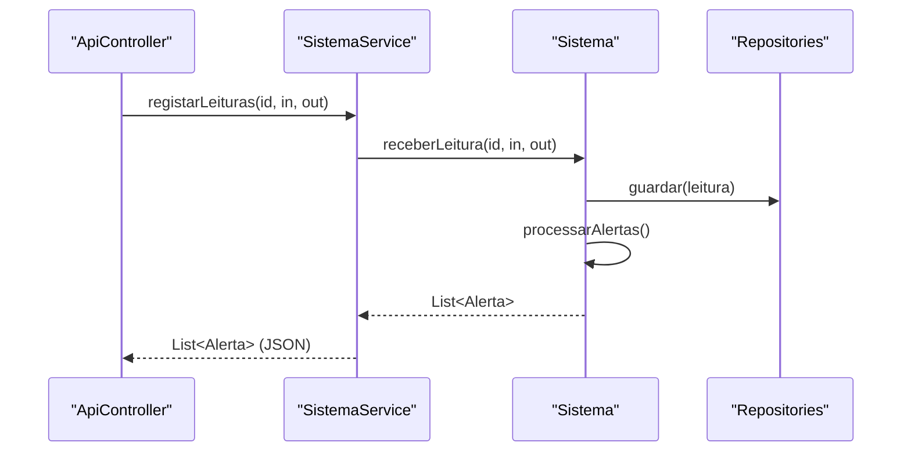

# Lógica de Negócio — Sistema e SistemaService

Esta página descreve a lógica de domínio principal da plataforma PGU-TUB. A lógica de negócio está encapsulada numa estrutura de duas camadas: a classe `Sistema`, que trata das regras puras do domínio, das transições de estado e da orquestração da persistência; e a classe `SistemaService`, que funciona como ponte entre os controladores REST e o domínio, executando a transformação de dados e operações de segurança.

## Visão Geral da Arquitetura

O sistema segue uma abordagem orientada a serviços, na qual o `SistemaService` envolve a instância de `Sistema` para fornecer uma API limpa ao `ApiController`.

### Mapeamento Linguagem Natural para Entidades de Código

O diagrama seguinte liga requisitos de negócio de alto nível a componen**Mapeamento da Lógica de Negócio**

#### 💡 Explicação do Mapeamento da Lógica de Negócio
* **Explicação Simplória (Para Entender):**
  Este diagrama é como um dicionário que traduz o que as pessoas dizem em código real do computador. Por exemplo, se a regra de negócio diz "Processar Dados dos Sensores", o programador vai à classe `Sistema.java` e corre o método `receberLeitura()`. Se a regra diz "Gerar Alertas", a classe `Autocarro.java` corre o `processarLeitura()`. Mapeia cada desejo ou regra de negócio ao seu correspondente pedaço de código executável.
* **Explicação Técnica e Específica:**
  Mapeamento de rastreabilidade entre o espaço de requisitos funcionais em linguagem natural e as entidades físicas de código (classes e métodos do Spring Boot). Os processos operacionais IoT (`Process Sensor Data` e `Generate Alerts`) são traduzidos respetivamente em chamadas síncronas de orquestração na fachada `Sistema.java` e avaliação de limiares em `Autocarro.java` recorrendo a `ThresholdsAlerta.java`. A gestão administrativa (`Manage Fleet` e `Authenticate Users`) é delegada diretamente à camada de aplicação `SistemaService.java` que faz a ponte com os repositórios JDBC do pacote `data` para persistência robusta.

Fontes: [backend_java/src/main/java/pt/uminho/dai/pgu/business/analitica_historico/Sistema.java:9-18](), [backend_java/src/main/java/pt/uminho/dai/pgu/api/analitica_historico/SistemaService.java:14-22]()

---

## Sistema.java: Lógica Central do Domínio

A classe `Sistema` é o orquestrador central da camada de domínio. Gere o ciclo de vida de veículos (`Autocarro`), linhas (`Linha`) e passageiros (`Cliente`), coordenando-se com vários repositórios para a persistência.

### Processamento de Lotação e Geração de Alertas
A lógica mais crítica reside na ingestão de dados de sensores via `receberLeitura`.

1. **Ingestão de Dados**: Recebe `entradas` (boardings) e `saidas` (alightings) para um determinado `autocarroId` [backend_java/src/main/java/pt/uminho/dai/pgu/business/analitica_historico/Sistema.java:108-112]().
2. **Atualização de Estado**: O modelo `Autocarro` processa o `LeituraContagem` para atualizar a contagem atual de passageiros e a taxa de lotação [backend_java/src/main/java/pt/uminho/dai/pgu/business/analitica_historico/Sistema.java:116-117]().
3. **Avaliação de Limiar**: Usando `ThresholdsAlerta`, o sistema verifica se a nova lotação ultrapassa os limites definidos (por exemplo, 80% para `LOTACAO_CRITICA`) [backend_java/src/main/java/pt/uminho/dai/pgu/business/analitica_historico/Sistema.java:33]().
4. **Persistência e Notificação**: A leitura é guardada em `RegistoViagemRepository`, eventuais alertas gerados são guardados em `RepositorioAlertas` e os clientes relevantes são notificados [backend_java/src/main/java/pt/uminho/dai/pgu/business/analitica_historico/Sistema.java:119-128]().

### Autenticação de Administrador
O login de administrador é tratado diretamente em `Sistema` usando uma regra específica do domínio:
* O email deve terminar em `@uminho.pt` ou `@um` [backend_java/src/main/java/pt/uminho/dai/pgu/business/analitica_historico/Sistema.java:87]().
* A palavra-passe é comparada com a variável de ambiente `PGU_ADMIN_PASSWORD` ou com um valor de fallback [backend_java/src/main/java/pt/uminho/dai/pgu/business/analitica_historico/Sistema.java:82-84]().

Fontes: [backend_java/src/main/java/pt/uminho/dai/pgu/business/analitica_historico/Sistema.java:80-92](), [backend_java/src/main/java/pt/uminho/dai/pgu/business/analitica_historico/Sistema.java:108-129]()

---

## SistemaService.java: Wrapper da API e Transformação

`SistemaService` atua como camada `Service` na arquitetura Spring Boot. As suas responsabilidades principais são tratar das transformações de DTO, codificação de palavras-passe e preparação dos dados para serialização JSON.

### Fluxo de Dados: Sensor para Dashboard
O diagrama abaixo ilustra como os dados fluem do conceito físico (Leitura) até à resposta da API.

**Fluxo de Transformação de Dados**

#### 💡 Explicação do Fluxo de Transformação de Dados
* **Explicação Simplória (Para Entender):**
  Este diagrama de sequência mostra como as classes trabalham em conjunto quando um sensor envia uma leitura. O `ApiController` (que fala com a internet) passa o ID do autocarro e o número de pessoas que entraram/saíram para o `SistemaService`. O `SistemaService` liga para o cérebro da lógica (`Sistema.java`) que faz as contas, manda guardar tudo no disco/base de dados (`Repositories`), analisa se é preciso gerar algum alarme operacional e devolve a lista de alertas até à API para ser exibida nos ecrãs em formato JSON.
* **Explicação Técnica e Específica:**
  Diagrama de interação para o processamento e transformação de payloads IoT. O `ApiController` recebe os dados HTTP síncronos e invoca `registarLeituras()` no Application Service (`SistemaService`). Este delega a transação à fachada de domínio `Sistema` (`receberLeitura()`), que persiste os dados via Repositórios JDBC (`data`). O motor de negócio processa em cadeia o cálculo de alertas e devolve um objeto `List<Alerta>`, que é transformado e serializado de volta em JSON para o cliente no corpo da resposta HTTP.

Fontes: [backend_java/src/main/java/pt/uminho/dai/pgu/api/analitica_historico/SistemaService.java:28-30](), [backend_java/src/main/java/pt/uminho/dai/pgu/business/analitica_historico/Sistema.java:112-129]()

### Métodos de Transformação Principais

| Método | Função | Lógica |
| :--- | :--- | :--- |
| `consultarAutocarro` | Mapeamento de Dados | Converte um objeto `Autocarro` num `Map<String, Object>` para o frontend, calculando a percentagem de `taxaOcupacao` [backend_java/src/main/java/pt/uminho/dai/pgu/api/analitica_historico/SistemaService.java:32-44](). |
| `listarAutocarros` | Mapeamento de Coleção | Faz stream de todos os autocarros e mapeia-os para uma lista de mapas, fornecendo valores por omissão como "N/A" para campos nulos [backend_java/src/main/java/pt/uminho/dai/pgu/api/analitica_historico/SistemaService.java:46-61](). |
| `signupCliente` | Segurança | Gera um UUID e usa o `PasswordEncoder` para fazer hash da palavra-passe antes de chamar a camada de domínio [backend_java/src/main/java/pt/uminho/dai/pgu/api/analitica_historico/SistemaService.java:92-96](). |
| `loginCliente` | Autenticação | Procura o cliente por email e usa `passwordEncoder.matches()` para verificação segura [backend_java/src/main/java/pt/uminho/dai/pgu/api/analitica_historico/SistemaService.java:98-109](). |

### Correlação e Histórico
O `SistemaService` também disponibiliza dados analíticos de alto nível:
* **Correlação**: Agrega dados de procura vs. oferta para intervalos de datas específicos [backend_java/src/main/java/pt/uminho/dai/pgu/api/analitica_historico/SistemaService.java:83-90]().
* **Histórico Diário**: Devolve uma estrutura aninhada de Map representando contagens de passageiros categorizadas por dia e hora [backend_java/src/main/java/pt/uminho/dai/pgu/api/analitica_historico/SistemaService.java:67-69]().

Fontes: [backend_java/src/main/java/pt/uminho/dai/pgu/api/analitica_historico/SistemaService.java:32-61](), [backend_java/src/main/java/pt/uminho/dai/pgu/api/analitica_historico/SistemaService.java:83-109]()
