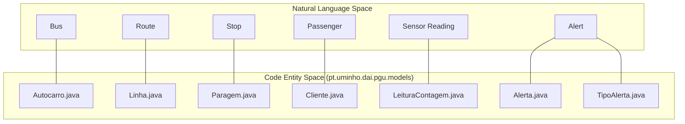
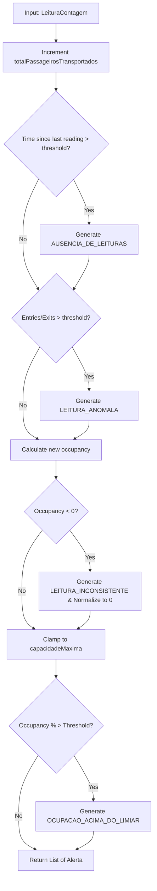
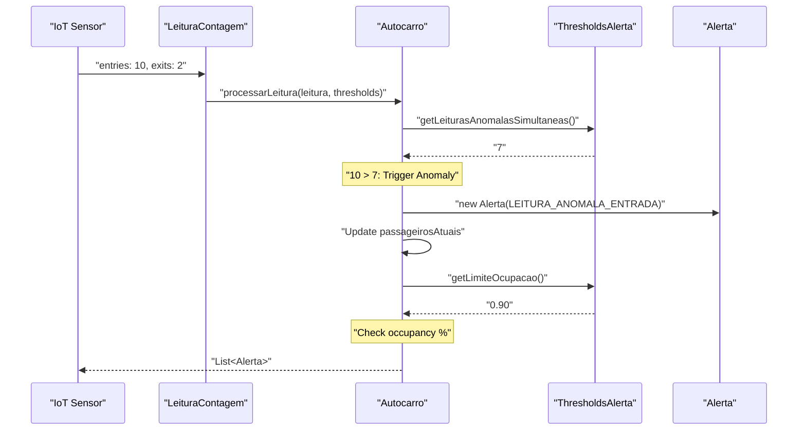

# Modelos de Domínio

Esta secção apresenta uma referência técnica para as entidades centrais de domínio do backend PGU/TUB. Estes modelos representam a lógica de negócio e o estado da rede de transportes, incluindo veículos, passageiros e o sistema automatizado de alertas.

## Relações Entre Entidades Centrais

O domínio organiza-se em torno da classe `Autocarro`, que agrega dados de sensores (`LeituraContagem`) e avalia regras de negócio contra `ThresholdsAlerta` para produzir instâncias de `Alerta`.

### Mapa de Entidades de Domínio
O diagrama seguinte mapeia os conceitos lógicos de transporte para as respetivas implementações em Java.

**Mapeamento de Domínio de Transporte para Código**

**Fontes:** [backend_java/src/main/java/pt/uminho/dai/pgu/models/Autocarro.java:12-27](), [backend_java/src/main/java/pt/uminho/dai/pgu/models/Linha.java:8-11](), [backend_java/src/main/java/pt/uminho/dai/pgu/models/Cliente.java:10-17]()

---

## Autocarro e Lógica de Negócio

A classe `Autocarro` é o principal contentor de estado. Mantém os níveis de lotação em tempo real, dados históricos (com limites de memória) e a lógica para processar novos dados de sensor.

### Campos e Restrições Principais
*   **Gestão de Memória**: Para evitar `OutOfMemoryError` em operações prolongadas, a classe impõe limites às listas de histórico: `MAX_HISTORICO_LEITURAS` (500) e `MAX_HISTORICO_ALERTAS` (200) [backend_java/src/main/java/pt/uminho/dai/pgu/models/Autocarro.java:14-15]().
*   **Acompanhamento de Estado**: Mantém o registo de `passageirosAtuais`, `totalPassageirosTransportados` e `ultimaLeitura` [backend_java/src/main/java/pt/uminho/dai/pgu/models/Autocarro.java:22-24]().

### O Método `processarLeitura()`
Esta é a função central de lógica de negócio. Recebe um `LeituraContagem` e um `ThresholdsAlerta`, atualiza o estado do autocarro e devolve uma lista dos alertas gerados [backend_java/src/main/java/pt/uminho/dai/pgu/models/Autocarro.java:121-184]().

**Fluxo Lógico de `processarLeitura()`**

**Fontes:** [backend_java/src/main/java/pt/uminho/dai/pgu/models/Autocarro.java:121-184](), [backend_java/src/main/java/pt/uminho/dai/pgu/models/ThresholdsAlerta.java:7-10]()

---

## Componentes do Sistema de Alertas

O sistema usa uma combinação de objetos de dados e enumerações para gerir as notificações.

### Alerta e TipoAlerta
`Alerta` é um record imutável que representa um evento do sistema [backend_java/src/main/java/pt/uminho/dai/pgu/models/Alerta.java:9-22](). A sua categoria é definida pelo enum `TipoAlerta`:

| TipoAlerta | Condição de Disparo |
| :--- | :--- |
| `OCUPACAO_ACIMA_DO_LIMIAR` | A lotação ultrapassa a percentagem configurada (90% por omissão). |
| `LEITURA_ANOMALA_ENTRADA` | As entradas numa única leitura ultrapassam o limiar (7 por omissão). |
| `LEITURA_ANOMALA_SAIDA` | As saídas numa única leitura ultrapassam o limiar (7 por omissão). |
| `LEITURA_INCONSISTENTE` | A leitura resulta numa lotação negativa. |
| `AUSENCIA_DE_LEITURAS` | O tempo desde a última leitura ultrapassa o limite (15 minutos por omissão). |

**Fontes:** [backend_java/src/main/java/pt/uminho/dai/pgu/models/TipoAlerta.java:5-11](), [backend_java/src/main/java/pt/uminho/dai/pgu/models/ThresholdsAlerta.java:12-14]()

### ThresholdsAlerta
Esta classe encapsula a configuração do motor de alertas.
*   `limiteOcupacao`: Double (0.0 a 1.0).
*   `leiturasAnomalasSimultaneas`: Inteiro.
*   `limiteSemLeituras`: `java.time.Duration`.

**Fontes:** [backend_java/src/main/java/pt/uminho/dai/pgu/models/ThresholdsAlerta.java:7-10]()

---

## Modelos de Passageiro e Infraestrutura

### Cliente
Representa os utilizadores do sistema (passageiros). Armazena dados pessoais e uma lista de instâncias de `Alerta` recebidas pelo utilizador [backend_java/src/main/java/pt/uminho/dai/pgu/models/Cliente.java:10-17]().
*   `receberAlertas(List<Alerta>)`: Anexa novos alertas ao histórico do utilizador [backend_java/src/main/java/pt/uminho/dai/pgu/models/Cliente.java:65-67]().

### Linha e Paragem
Estes modelos definem a topologia física da rede.
*   **Linha**: Contém uma lista de objetos `Paragem` [backend_java/src/main/java/pt/uminho/dai/pgu/models/Linha.java:8-15]().
*   **Paragem**: Wrapper simples para o nome de uma paragem [backend_java/src/main/java/pt/uminho/dai/pgu/models/Paragem.java:5-9]().

### LeituraContagem
Um data transfer object (DTO) usado pela pipeline de ingestão IoT. É imutável e valida que as entradas/saídas são não negativas [backend_java/src/main/java/pt/uminho/dai/pgu/models/LeituraContagem.java:8-20]().

---

## Fluxo de Dados: Leitura para Alerta

Este diagrama ilustra como os dados percorrem os modelos de domínio durante uma atualização de sensor.

**Fluxo de Dados de Ingestão IoT**

**Fontes:** [backend_java/src/main/java/pt/uminho/dai/pgu/models/Autocarro.java:121-184](), [backend_java/src/main/java/pt/uminho/dai/pgu/models/LeituraContagem.java:13-20](), [backend_java/src/main/java/pt/uminho/dai/pgu/models/ThresholdsAlerta.java:16-26]()
