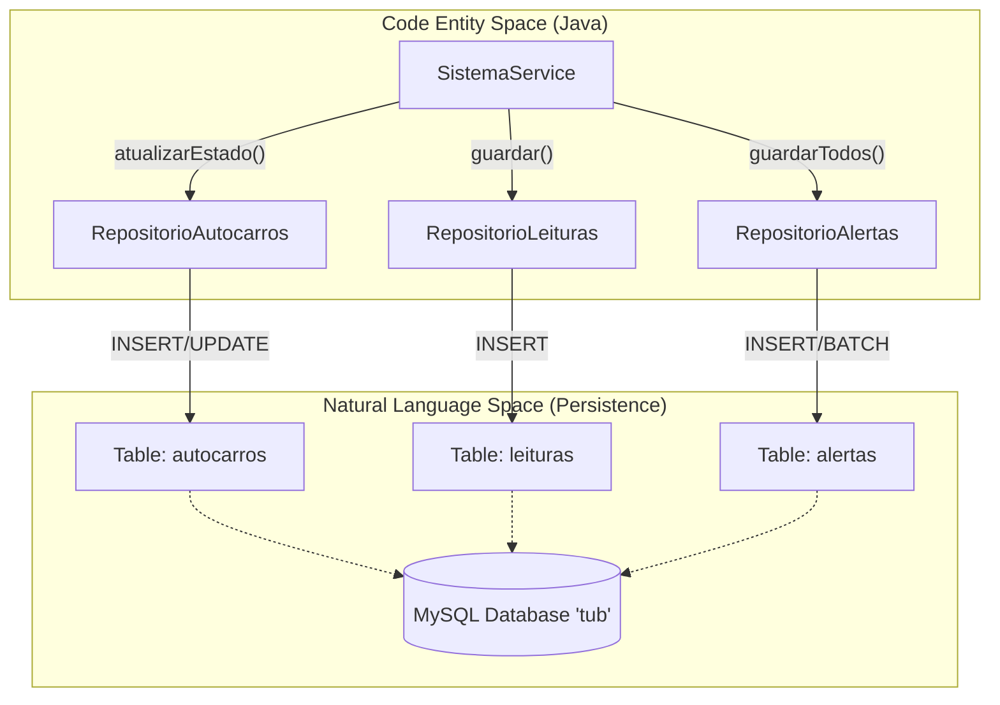
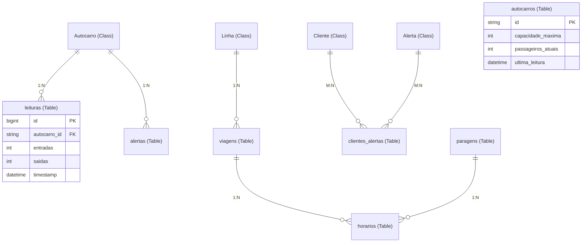

# Camada de Dados — Repositórios e Base de Dados

A Camada de Dados disponibiliza um mecanismo centralizado de persistência para a plataforma PGU/TUB. Utiliza o **Repository Pattern** para abstrair as operações de base de dados, um helper JDBC personalizado para a gestão de ligações com configurações sensíveis ao ambiente, e um esquema MySQL normalizado, otimizado com índices B-Tree para a ingestão de dados IoT em alta frequência.

## Gestão da Ligação à Base de Dados

A classe `DatabaseConnection` gere as ligações JDBC à base de dados MySQL. Implementa uma estratégia de resolução de configuração em várias etapas para assegurar a compatibilidade entre o desenvolvimento local (Docker) e os ambientes de produção (Azure App Service).

### Estratégia de Resolução da Ligação
O sistema resolve as credenciais da base de dados pela seguinte ordem de prioridade:
1.  **Variáveis de Ambiente do Sistema**: Primárias para configurações em Azure App Service [backend_java/src/main/java/pt/uminho/dai/pgu/repositories/DatabaseConnection.java:61-61]().
2.  **Ficheiro .env**: Cache de desenvolvimento local [backend_java/src/main/java/pt/uminho/dai/pgu/repositories/DatabaseConnection.java:62-62]().
3.  **Valores por Omissão Hardcoded**: Fallback para configurações Docker standard (por exemplo, `tub_user`/`tub_pass`) [backend_java/src/main/java/pt/uminho/dai/pgu/repositories/DatabaseConnection.java:21-24]().

### Segurança e Fiabilidade
Quando o sistema deteta que está a operar fora de localhost, força automaticamente o uso de **SSL/TLS** para uma comunicação segura com o Azure MySQL Flexible Server [backend_java/src/main/java/pt/uminho/dai/pgu/repositories/DatabaseConnection.java:91-97](). A connection string inclui parâmetros para evitar ligações pendentes, como `connectTimeout=5000` e `socketTimeout=30000` [backend_java/src/main/java/pt/uminho/dai/pgu/repositories/DatabaseConnection.java:84-85]().

**Fontes:**
- `pt.uminho.dai.pgu.repositories.DatabaseConnection` [backend_java/src/main/java/pt/uminho/dai/pgu/repositories/DatabaseConnection.java:1-101]()

---

## Implementação do Padrão Repository

O backend usa classes de repositório especializadas para tratar de operações CRUD e de queries analíticas complexas. Estes repositórios fazem a ponte entre os modelos de domínio em Java e o esquema SQL.

### Arquitetura dos Repositórios e Fluxo de Dados

O diagrama seguinte ilustra como a camada de Repositório medeia entre a camada de Serviço e a base de dados MySQL.

**Title: Data Flow from Service to Database**

**Fontes:**
- `pt.uminho.dai.pgu.repositories.RepositorioAutocarros` [backend_java/src/main/java/pt/uminho/dai/pgu/repositories/RepositorioAutocarros.java:1-103]()
- `pt.uminho.dai.pgu.repositories.RepositorioLeituras` [backend_java/src/main/java/pt/uminho/dai/pgu/repositories/RepositorioLeituras.java:1-58]()

### Classes de Repositório Principais

| Classe | Responsabilidade Principal | Método Principal |
| :--- | :--- | :--- |
| `RepositorioAutocarros` | Gere o estado e os metadados dos veículos. | `atualizarEstado(Autocarro)` [backend_java/src/main/java/pt/uminho/dai/pgu/repositories/RepositorioAutocarros.java:78-94]() |
| `RepositorioLeituras` | Persiste os dados dos sensores IoT (entradas/saídas). | `obterHistoricoPorDia()` [backend_java/src/main/java/pt/uminho/dai/pgu/repositories/RepositorioLeituras.java:34-57]() |
| `RepositorioAlertas` | Armazena os alertas gerados pelo sistema. | `guardarTodos(List<Alerta>)` [backend_java/src/main/java/pt/uminho/dai/pgu/repositories/RepositorioAlertas.java:17-39]() |
| `RepositorioCorrelacao` | Executa JOINs pesados para a analítica do dashboard. | `obterProcuraPorLinha(start, end)` [backend_java/src/main/java/pt/uminho/dai/pgu/repositories/RepositorioCorrelacao.java:20-54]() |
| `RepositorioClientes` | Trata dos perfis dos passageiros e dos dados de autenticação. | `procurarPorEmail(String)` [backend_java/src/main/java/pt/uminho/dai/pgu/repositories/RepositorioClientes.java:59-63]() |

**Fontes:**
- `pt.uminho.dai.pgu.repositories.RepositorioCorrelacao` [backend_java/src/main/java/pt/uminho/dai/pgu/repositories/RepositorioCorrelacao.java:1-110]()
- `pt.uminho.dai.pgu.repositories.RepositorioAlertas` [backend_java/src/main/java/pt/uminho/dai/pgu/repositories/RepositorioAlertas.java:1-61]()

---

## Esquema da Base de Dados (MySQL)

O esquema da base de dados, definido em `init.sql`, é composto por 10 tabelas concebidas para suportar a monitorização em tempo real, a análise histórica e os horários do transporte público.

### Mapeamento Entidade-Relação

O diagrama seguinte mapeia as entidades de código para a estrutura da base de dados.

**Title: Code Entity to Database Table Mapping**

**Fontes:**
- Definições do esquema `init.sql` [init.sql:1-95]()

### Otimização de Desempenho
Para suportar o elevado volume de leituras de sensores e as queries de correlação complexas, o esquema inclui vários índices B-Tree:
*   **Índices de Chave Estrangeira**: `idx_leituras_autocarro` e `idx_alertas_autocarro` aceleram as pesquisas para veículos específicos [init.sql:102-103]().
*   **Índices Temporais**: `idx_leituras_timestamp` e `idx_alertas_timestamp` otimizam as vistas de dashboard que filtram por intervalos de datas [init.sql:108-109]().
*   **Pesquisas de Horários**: `idx_horarios_viagem` e `idx_viagens_linha` garantem a obtenção rápida dos horários dos autocarros [init.sql:106-107]().

### Queries Analíticas Complexas
O `RepositorioCorrelacao` utiliza SQL avançado para agregar os dados diretamente na base de dados, reduzindo o payload enviado para o backend. Por exemplo, `obterProcuraPorLinha` faz um `JOIN` entre `leituras` e `autocarros`, agrupando por `linha_id` para calcular o total de entradas/saídas por linha [backend_java/src/main/java/pt/uminho/dai/pgu/repositories/RepositorioCorrelacao.java:23-33]().

**Fontes:**
- Secção de otimização de `init.sql` [init.sql:97-110]()
- `RepositorioCorrelacao.java` [backend_java/src/main/java/pt/uminho/dai/pgu/repositories/RepositorioCorrelacao.java:20-54]()
