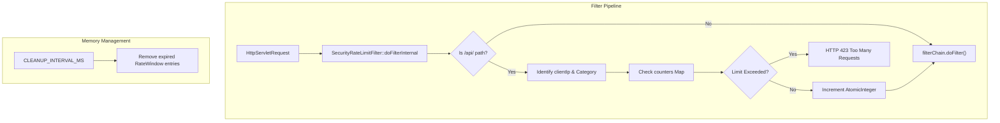
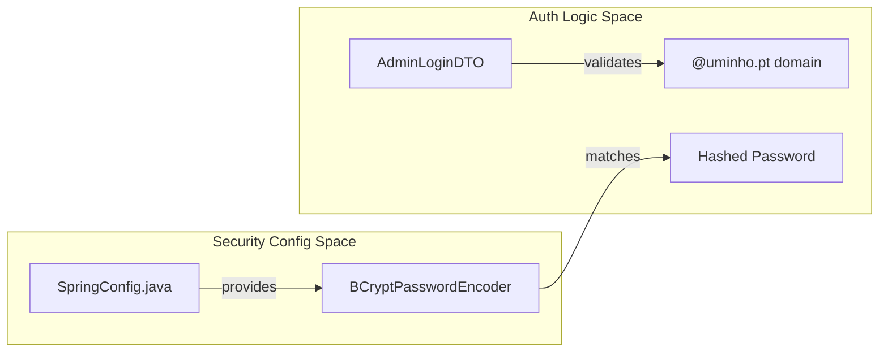

# Segurança — Rate Limiting e Autenticação

Esta página documenta a infraestrutura de segurança do backend PGU/TUB, focando-se na proteção dos endpoints sensíveis contra ataques de força bruta, na implementação de hashing de palavras-passe, nas restrições administrativas baseadas em domínio e na validação de pedidos.

## Rate Limiting e Proteção contra Força Bruta

O sistema implementa um filtro `SecurityRateLimitFilter` personalizado para mitigar ataques de negação de serviço (DoS) e tentativas de login por força bruta. Este filtro opera por IP, utilizando janelas deslizantes para diferentes categorias da API [backend_java/src/main/java/pt/uminho/dai/pgu/api/SecurityRateLimitFilter.java:27-27]().

### Configurações de Rate Limit
O filtro distingue três níveis de acesso com base no URI do pedido e no método HTTP [backend_java/src/main/java/pt/uminho/dai/pgu/api/SecurityRateLimitFilter.java:84-97]():

| Categoria | Padrão de Endpoint | Limite | Janela | Propósito |
| :--- | :--- | :--- | :--- | :--- |
| **Login** | `POST /api/auth/login*` | 5 pedidos | 15 minutos | Proteção contra força bruta [backend_java/src/main/java/pt/uminho/dai/pgu/api/SecurityRateLimitFilter.java:33-33]() |
| **Auth Geral** | `/api/auth/*` | 12 pedidos | 1 minuto | Proteção de gestão de sessão [backend_java/src/main/java/pt/uminho/dai/pgu/api/SecurityRateLimitFilter.java:34-34]() |
| **API Geral** | `/api/*` | 120 pedidos | 1 minuto | Throttling de utilização de recursos [backend_java/src/main/java/pt/uminho/dai/pgu/api/SecurityRateLimitFilter.java:35-35]() |

### Detalhes de Implementação
O filtro usa um `ConcurrentHashMap` para armazenar objetos `RateWindow` para cada IP de cliente [backend_java/src/main/java/pt/uminho/dai/pgu/api/SecurityRateLimitFilter.java:41-41](). Para evitar fugas de memória durante ataques sustentados, uma tarefa de limpeza periódica remove as entradas expiradas a cada 5 minutos [backend_java/src/main/java/pt/uminho/dai/pgu/api/SecurityRateLimitFilter.java:38-39]().

**Fluxo de Dados: Verificação de Rate Limit**
O diagrama seguinte ilustra como o `SecurityRateLimitFilter` processa um `HttpServletRequest` recebido.

Title: SecurityRateLimitFilter Processing Flow

Fontes: [backend_java/src/main/java/pt/uminho/dai/pgu/api/SecurityRateLimitFilter.java:56-128]()

## Autenticação e Segurança das Palavras-passe

### Hashing de Palavras-passe
A aplicação usa `BCryptPasswordEncoder` para o armazenamento seguro de palavras-passe [backend_java/src/main/java/pt/uminho/dai/pgu/api/SpringConfig.java:49-51](). O BCrypt garante que as palavras-passe nunca são armazenadas em texto simples na base de dados, oferecendo resistência a ataques de rainbow table através do seu mecanismo interno de salting.

### Restrição de Domínio para Administradores
O acesso administrativo é estritamente restrito por domínio de email. Apenas utilizadores com um endereço `@uminho.pt` estão autorizados a autenticar-se como administradores. Esta lógica é aplicada durante o processo de login, em que o sistema valida o sufixo do domínio do email fornecido.

Title: Authentication Component Interaction

Fontes: [backend_java/src/main/java/pt/uminho/dai/pgu/api/SpringConfig.java:49-51](), [backend_java/src/main/java/pt/uminho/dai/pgu/api/dto/AdminLoginDTO.java:7-20]()

## Estratégia de Validação de Inputs

O backend utiliza **Jakarta Bean Validation** (anteriormente JSR 303/380) para impor a integridade dos dados na fronteira da API. Isto garante que dados mal-formados ou maliciosos são rejeitados antes de chegarem à camada de serviço.

### Data Transfer Objects (DTOs)
As restrições de validação são aplicadas diretamente nos campos dos DTOs através de anotações.

*   **Validação de Email**: Usa `@Email` para garantir o formato RFC adequado e `@NotBlank` para impedir submissões vazias [backend_java/src/main/java/pt/uminho/dai/pgu/api/dto/AdminLoginDTO.java:8-10]().
*   **Complexidade da Palavra-passe**: Usa `@Size(min = 4, max = 128)` para impor requisitos de comprimento [backend_java/src/main/java/pt/uminho/dai/pgu/api/dto/ClienteLoginDTO.java:13-13]().

### Resumo das Regras de Validação
| Classe DTO | Campo | Restrições |
| :--- | :--- | :--- |
| `AdminLoginDTO` | `email` | `@NotBlank`, `@Email` [backend_java/src/main/java/pt/uminho/dai/pgu/api/dto/AdminLoginDTO.java:8-10]() |
| `AdminLoginDTO` | `password` | `@NotBlank`, `@Size(min=4, max=128)` [backend_java/src/main/java/pt/uminho/dai/pgu/api/dto/AdminLoginDTO.java:12-14]() |
| `ClienteLoginDTO` | `email` | `@NotBlank`, `@Email` [backend_java/src/main/java/pt/uminho/dai/pgu/api/dto/ClienteLoginDTO.java:8-10]() |
| `ClienteLoginDTO` | `password` | `@NotBlank`, `@Size(min=4, max=128)` [backend_java/src/main/java/pt/uminho/dai/pgu/api/dto/ClienteLoginDTO.java:12-14]() |

Fontes: [backend_java/src/main/java/pt/uminho/dai/pgu/api/dto/AdminLoginDTO.java:1-20](), [backend_java/src/main/java/pt/uminho/dai/pgu/api/dto/ClienteLoginDTO.java:1-20]()

## Cross-Origin Resource Sharing (CORS)

Para permitir que o frontend Vue.js comunique com a API Spring Boot, é definida uma configuração global de CORS em `SpringConfig.java`. Permite pedidos de qualquer origem (configurada por flexibilidade em desenvolvimento) e suporta os métodos REST standard: `GET`, `POST`, `PUT`, `DELETE` e `OPTIONS` [backend_java/src/main/java/pt/uminho/dai/pgu/api/SpringConfig.java:54-60]().

Fontes: [backend_java/src/main/java/pt/uminho/dai/pgu/api/SpringConfig.java:54-60]()
