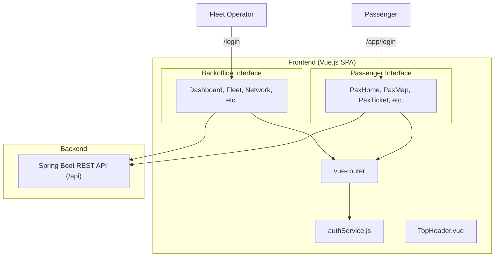
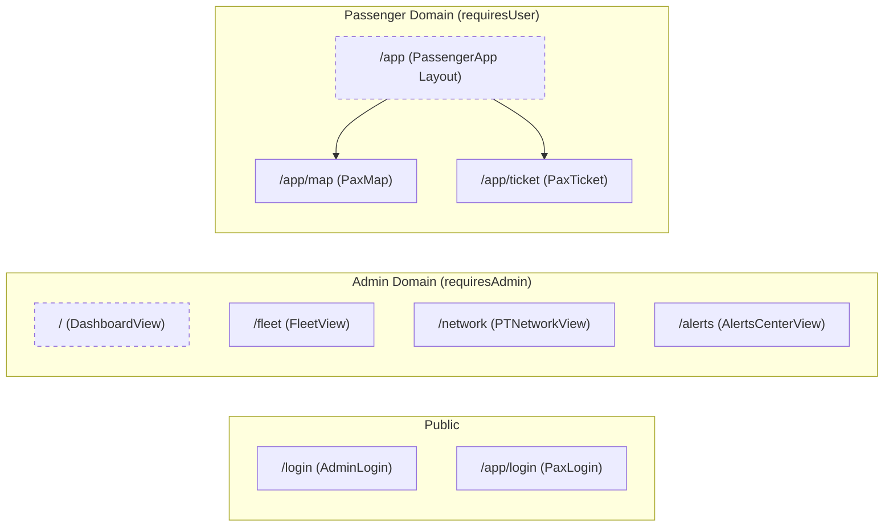

# Frontend — Aplicação Vue.js

O frontend PGU-TUB é uma Single Page Application (SPA) construída com **Vue 3** [frontend_vue/package.json:18-18](). Serve dois grupos principais de utilizadores através de interfaces distintas: um **Backoffice Dashboard** de elevada densidade para os operadores de frota e uma **PWA do Passageiro** otimizada para mobile destinada aos utilizadores dos transportes.

A aplicação é servida por um servidor Node.js/Express [frontend_vue/server.js:1-11]() que disponibiliza os recursos estáticos e faz proxy dos pedidos da API para o backend Spring Boot [frontend_vue/server.js:14-18]().

### Arquitetura da Aplicação

O frontend segue uma estrutura modular em que serviços e componentes partilhados suportam dois layouts principais. O ponto de entrada `index.html` monta a aplicação Vue numa única `
` com `#app` [frontend_vue/index.html:10-11]().

#### Diagrama de Contexto do Sistema
Este diagrama mostra como a aplicação Vue se liga ao backend e trata os dois perfis de utilizador.

**Fontes:** [frontend_vue/src/router/index.js:25-105](), [frontend_vue/server.js:14-18](), [frontend_vue/src/components/TopHeader.vue:4-4]()

### Infraestrutura Central

A aplicação assenta em vários sistemas partilhados para manter o estado e a segurança em ambas as interfaces.

*   **Routing e Guards:** Geridos pelo `vue-router`, definindo caminhos para tarefas administrativas (por exemplo, `/fleet`, `/occupancy`) e para tarefas dos passageiros (sob o prefixo `/app`) [frontend_vue/src/router/index.js:40-96](). Os guards de navegação impõem o controlo de acesso baseado em perfil [frontend_vue/src/router/index.js:107-124]().
*   **Serviço de Autenticação:** Um `authService` centralizado gere a persistência de sessão. Usa `sessionStorage` para administradores (apagado ao fechar o separador) e `localStorage` com TTL de 7 dias para passageiros [frontend_vue/src/router/index.js:108-121]().
*   **Modo Demo:** Um toggle global de simulação, gerido em `TopHeader.vue`, permite que a interface alterne entre dados reais em produção e dados mock locais para testes e demonstrações [frontend_vue/src/components/TopHeader.vue:14-18]().

#### Mapa de Navegação e Routing
Este diagrama mapeia a estrutura de URLs da aplicação aos componentes Vue correspondentes e aos requisitos de segurança.

**Fontes:** [frontend_vue/src/router/index.js:27-104]()

### Componentes e Serviços Partilhados

A aplicação utiliza um conjunto de componentes partilhados para garantir uma experiência consistente. O mais proeminente é o `TopHeader.vue`, que mostra o nome da vista atual, o estado do sistema (Online vs. Simulação) e a informação do perfil de administrador [frontend_vue/src/components/TopHeader.vue:26-62]().

| Funcionalidade | Implementação | Descrição |
| :--- | :--- | :--- |
| **Ícones** | `lucide-vue-next` | Iconografia vetorial consistente em todas as vistas [frontend_vue/package.json:17-17](). |
| **Mapas** | `leaflet` | Renderização interativa de mapas para acompanhamento de veículos [frontend_vue/package.json:16-16](). |
| **Gráficos** | `chart.js` | Visualização de dados para KPIs de lotação e correlação [frontend_vue/package.json:13-13](). |
| **Proxy** | `express-http-proxy` | Encaminha as chamadas `/api` da porta do frontend para o URL do backend [frontend_vue/server.js:14-18](). |

### Detalhes dos Submódulos

Para documentação técnica detalhada sobre partes específicas do frontend, consulte as páginas filhas seguintes:

#### [3.1 Routing, Serviço de Autenticação e Componentes Partilhados](10-Routing-Auth-Componentes.md)
Análise detalhada da lógica do `authService.js`, da utilidade `apiFetch` com fallbacks de modo demo e da configuração dos guards globais de navegação.
*   *Ficheiros principais:* `src/router/index.js`, `src/services/auth.js`, `src/components/TopHeader.vue`.

#### [3.2 Backoffice — Painel do Operador](11-Backoffice-Dashboard.md)
Visão geral técnica das vistas para operadores, incluindo o mapa em tempo real da rede PT, as tabelas de gestão de frota e os gráficos de correlação ocupação/procura.
*   *Ficheiros principais:* `src/views/DashboardView.vue`, `src/views/PTNetworkView.vue`, `src/views/FleetView.vue`.

#### [3.3 PWA do Passageiro — Interface Móvel](12-PWA-Passageiro.md)
Documentação sobre a aplicação mobile-first do passageiro, focada no planeador de viagens, no acompanhamento em tempo real dos autocarros e no sistema de bilhética virtual.
*   *Ficheiros principais:* `src/layouts/PassengerApp.vue`, `src/views/passenger/LiveMapView.vue`, `src/views/passenger/HomeView.vue`.

**Fontes:**
- [frontend_vue/package.json:1-27]()
- [frontend_vue/src/router/index.js:1-127]()
- [frontend_vue/src/components/TopHeader.vue:1-63]()
- [frontend_vue/server.js:1-32]()
