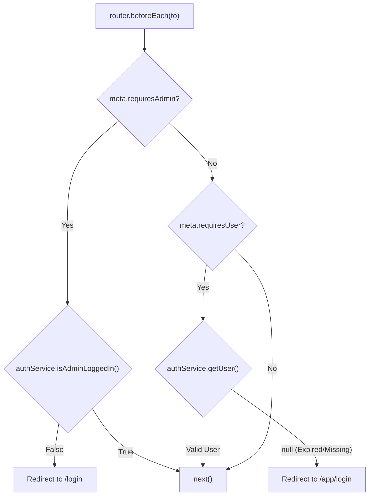
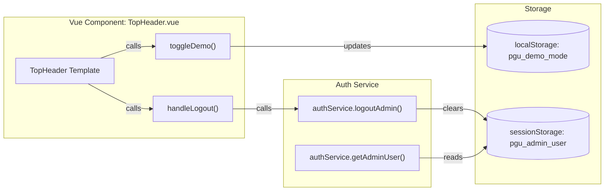

# Routing, Serviço de Autenticação e Componentes Partilhados

Esta secção detalha a infraestrutura central do frontend Vue.js, focando-se na forma como a aplicação gere a navegação, impõe as fronteiras de segurança entre perfis de utilizador e trata da obtenção de dados através de um serviço de API híbrido.

## Estratégia de Routing e Route Guards

A aplicação usa o `vue-router` para gerir duas interfaces distintas: o **Backoffice** (para operadores de frota) e a **PWA do Passageiro** (para utilizadores móveis) [frontend_vue/src/router/index.js:3-22]().

A lógica de routing é governada por um guard global de navegação `router.beforeEach`, que avalia metadados associados a cada rota [frontend_vue/src/router/index.js:107-124]().

### Metadados de Rota e Proteção
- **Guard de Admin**: As rotas com `requiresAdmin: true` (por exemplo, `/fleet`, `/network`, `/alerts`) verificam `authService.isAdminLoggedIn()`. Em caso de falha, o utilizador é redirecionado para `/login` [frontend_vue/src/router/index.js:41-82, 109-112]().
- **Guard de Passageiro**: As rotas sob o caminho `/app` com `requiresUser: true` verificam `authService.getUser()`. Se a sessão estiver em falta ou expirada, o utilizador é redirecionado para `/app/login` [frontend_vue/src/router/index.js:85-96, 115-121]().

### Diagrama do Fluxo de Navegação

Title: Navigation Guard Logic Flow

Fontes: [frontend_vue/src/router/index.js:107-124]()

## Serviço de Autenticação (`authService.js`)

O `authService` faz a gestão de identidade e da persistência de sessão usando estratégias diferentes consoante o perfil de utilizador [frontend_vue/src/services/auth.js:1-10]().

### Comparação da Gestão de Sessão

| Característica | Admin (Backoffice) | Passageiro (Mobile) |
| :--- | :--- | :--- |
| **Armazenamento** | `sessionStorage` [frontend_vue/src/services/auth.js:8]() | `localStorage` [frontend_vue/src/services/auth.js:9]() |
| **TTL (Expiração)** | Por separador/sessão de browser [frontend_vue/src/services/auth.js:19]() | 7 dias (TTL fixo) [frontend_vue/src/services/auth.js:13]() |
| **Endpoint de Login** | `/api/auth/admin/login` [frontend_vue/src/services/auth.js:27]() | `/api/auth/login` [frontend_vue/src/services/auth.js:111]() |
| **Chave de Dados** | `pgu_admin_user` [frontend_vue/src/services/auth.js:42]() | `pgu_user` [frontend_vue/src/services/auth.js:136]() |

### Detalhes de Implementação
- **TTL do Passageiro**: A constante `PASSENGER_SESSION_TTL` está definida em 604.800.000 ms [frontend_vue/src/services/auth.js:13](). Ao obter a sessão, `getUser()` compara o timestamp atual com `pgu_user_login_at` para determinar se ainda é válida [frontend_vue/src/services/auth.js:71-78]().
- **Fallback Demo**: Tanto `signupPassenger` como `loginPassenger` incluem blocos `try-catch` que geram um "demo-user" local caso a API do backend esteja inacessível, garantindo que a PWA continua funcional em ambientes offline ou de demonstração [frontend_vue/src/services/auth.js:101-106, 127-132]().

Fontes: [frontend_vue/src/services/auth.js:12-158]()

## API Fetch e Modo Demo

O utilitário `apiFetch` funciona como proxy para todas as comunicações com o backend, implementando um fallback de "Modo Demo" [frontend_vue/src/services/api.js:98-116]().

### Lógica e Mecanismo de Fallback
1. **Toggle Manual**: Se `pgu_demo_mode` estiver definido como `true` em `localStorage`, o serviço devolve imediatamente dados mock [frontend_vue/src/services/api.js:100-105]().
2. **Fallback Automático**: Se o pedido fetch falhar (por exemplo, ligação recusada) ou expirar (4000 ms), o serviço apanha o erro e devolve o objeto de dados mock correspondente [frontend_vue/src/services/api.js:107-115]().

### Entidades de Dados Mock
O serviço fornece dados mock estruturados que espelham os DTOs do backend:
- `DEMO_AUTOCARROS`: Array de objetos de veículos com lotação e IDs de linha [frontend_vue/src/services/api.js:7-14]().
- `DEMO_ALERTAS`: Alertas simulados do sistema (por exemplo, `LOTACAO_CRITICA`) [frontend_vue/src/services/api.js:16-21]().
- `DEMO_CORRELACAO`: Métricas complexas para a análise oferta/procura [frontend_vue/src/services/api.js:31-75]().

Fontes: [frontend_vue/src/services/api.js:1-140]()

## Componentes Partilhados: TopHeader

O componente `TopHeader.vue` fornece uma barra de navegação e estado consistente para a interface do Backoffice [frontend_vue/src/components/TopHeader.vue:25-63]().

### Funcionalidades Principais
- **Título da Página**: Extrai dinamicamente o título a partir de `$route.name` [frontend_vue/src/components/TopHeader.vue:28]().
- **Toggle Demo**: Um botão que altera `pgu_demo_mode` em `localStorage` e dispara `window.location.reload()` para forçar o serviço `apiFetch` a mudar de modo [frontend_vue/src/components/TopHeader.vue:14-18, 33-41]().
- **Indicador de Estado**: Mostra "SIMULAÇÃO ATIVA" (laranja) ou "SISTEMA ONLINE" (verde) consoante o modo atual [frontend_vue/src/components/TopHeader.vue:48-51]().
- **Identidade de Admin**: Mostra o nome e o email do administrador autenticado, obtidos através de `authService.getAdminUser()` [frontend_vue/src/components/TopHeader.vue:11, 43-46]().

### Diagrama da Arquitetura do Componente

Title: TopHeader Integration with Services

Fontes: [frontend_vue/src/components/TopHeader.vue:1-60](), [frontend_vue/src/services/auth.js:45-61]()
