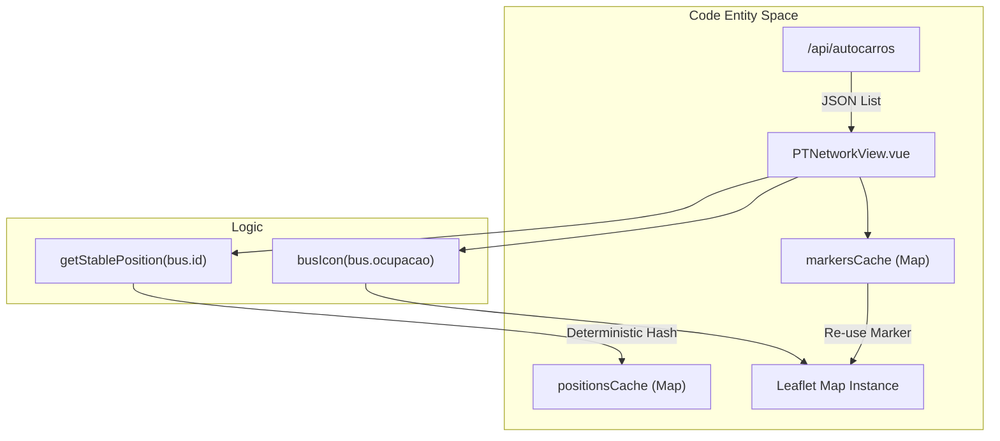
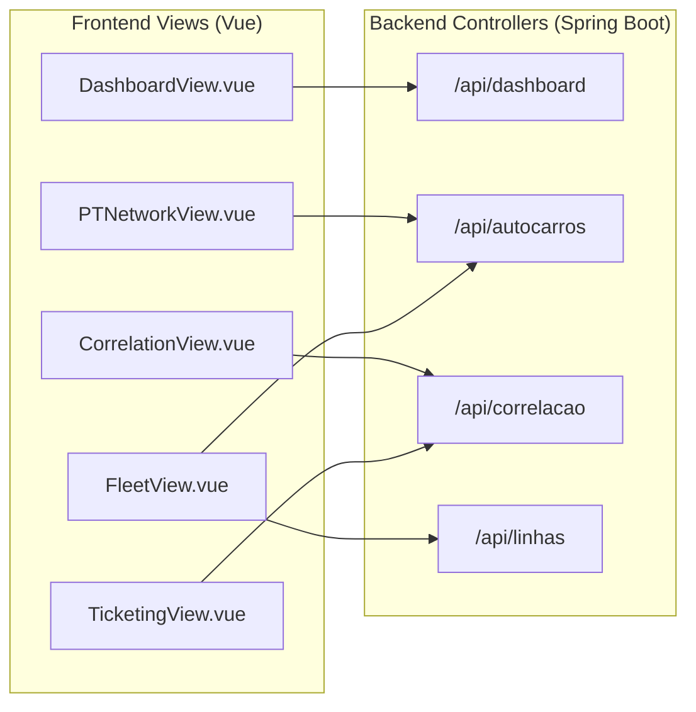

# Backoffice — Painel do Operador

O Backoffice é uma interface dedicada aos operadores de frota e administradores do sistema PGU/TUB. Disponibiliza um plano de controlo centralizado para monitorizar a lotação dos veículos em tempo real, gerir a frota física e analisar a correlação entre a oferta de transporte (GTFS) e a procura real (dados de sensores IoT).

## Arquitetura Central e Controlo de Acesso

O Backoffice é restrito a utilizadores institucionais. A autenticação é tratada por `LoginView.vue`, que impõe restrição de domínio para emails `@uminho.pt` ou `@um` [frontend_vue/src/views/admin/LoginView.vue:13-19](). As sessões são geridas via `authService.js`, que distingue entre perfis administrativo e de passageiro [frontend_vue/src/views/admin/LoginView.vue:25-26]().

### Visão Geral do Dashboard
O `DashboardView.vue` funciona como página inicial, fornecendo KPIs de alto nível e um toggle global de "Modo Demo".

*   **KPIs**: Mostra a Taxa Média de Lotação, o Volume Total de Passageiros e os Autocarros Ativos [frontend_vue/src/views/DashboardView.vue:81-110]().
*   **Toggle Modo Demo**: Funcionalidade crítica que permite aos operadores alternar entre "Modo Real" (Azure SQL Database) e "Modo Demo" (mocks JSON locais / dados simulados). Este estado é persistido em `localStorage` como `pgu_demo_mode` [frontend_vue/src/views/DashboardView.vue:16-25]().
*   **Alertas Críticos**: Feed em direto de veículos que ultrapassam os limiares de lotação e avisos recentes do sistema [frontend_vue/src/views/DashboardView.vue:113-144]().

**Fontes**: [frontend_vue/src/views/DashboardView.vue:1-146](), [frontend_vue/src/views/admin/LoginView.vue:1-32]()

## Mapa em Tempo Real da Rede (PTNetworkView)

O `PTNetworkView.vue` implementa um mapa de monitorização em tempo real através da biblioteca **Leaflet**. Visualiza toda a frota e as paragens dos transportes urbanos de Braga.

### Detalhes de Implementação
*   **Gestão de Marcadores**: Para evitar "jitter" visual durante atualizações rápidas de dados, a vista implementa um `positionsCache` e uma função `getStablePosition`. Esta utiliza um hash determinístico baseado em `bus.id` para garantir que os marcadores se mantêm na mesma coordenada, mesmo que o backend devolva metadados ligeiramente diferentes [frontend_vue/src/views/PTNetworkView.vue:18-23, 165-183]().
*   **Otimização de Desempenho**: As atualizações são bloqueadas durante interações com o mapa (zoom/move) através da flag `isZooming`, para prevenir lag na UI [frontend_vue/src/views/PTNetworkView.vue:24-27, 127-130]().
*   **Codificação Visual**: Os marcadores dos veículos são codificados por cor consoante a lotação:
    *   **Vermelho**: > 90% (Crítica)
    *   **Amarelo**: > 70% (Alta)
    *   **Teal/Cyan**: Normal [frontend_vue/src/views/PTNetworkView.vue:74-79]().

### Fluxo de Dados: Visualização do Mapa
Title: Map Entity Data Flow

**Fontes**: [frontend_vue/src/views/PTNetworkView.vue:1-203]()

## Gestão de Frota (FleetView)

O `FleetView.vue` disponibiliza a interface administrativa para registar novos veículos e reportar manualmente leituras de sensor para efeitos de teste.

*   **Validação Zero-Trust**: O frontend implementa validação regex estrita para todos os inputs:
    *   `MATRICULA_REGEX`: Impõe o formato português de matrícula (XX-XX-XX) [frontend_vue/src/views/FleetView.vue:29]().
    *   `LINHA_REGEX`: Impõe o formato "Lx" ou "Lxx" [frontend_vue/src/views/FleetView.vue:38]().
    *   `ID_REGEX`: Restringe os IDs de autocarro a 3-20 caracteres alfanuméricos [frontend_vue/src/views/FleetView.vue:32]().
*   **Registo Multi-passo**: Quando um autocarro é registado, a vista chama primeiro `POST /api/autocarros`. Se for fornecido um ID de linha, segue-se imediatamente um segundo pedido `POST /api/linhas/{id}/autocarros` para associar o veículo a uma rota [frontend_vue/src/views/FleetView.vue:123-152]().

**Fontes**: [frontend_vue/src/views/FleetView.vue:1-210]()

## Analítica: Correlação e Bilhética

O Backoffice inclui duas vistas especializadas para análise da procura: `CorrelationView.vue` e `TicketingView.vue`.

### Motor de Correlação (Oferta vs. Procura)
A `CorrelationView` cruza dados de lotação IoT com dados de horários GTFS.
*   **KPIs**: Calcula o "Rácio Passageiros/Viagem" para identificar linhas sub-utilizadas ou sobre-utilizadas [frontend_vue/src/views/CorrelationView.vue:140-148]().
*   **Visualizações**: Usa gráficos de barras CSS puros para mostrar a "Procura Real por Linha" (IoT) face à "Oferta Planeada" (GTFS) [frontend_vue/src/views/CorrelationView.vue:161-188]().
*   **Exportação**: Disponibiliza uma funcionalidade de exportação CSV que agrega o desempenho por linha, a procura horária e os perfis de bilhética [frontend_vue/src/views/CorrelationView.vue:66-90]().

### Análise de Bilhética
O `TicketingView.vue` foca-se nos aspetos financeiros e baseados em perfis da rede.
*   **Distribuição de Perfis**: Usa `Chart.js` (Bar e Doughnut) para visualizar o peso dos diferentes tipos de bilhete (Zapping, 4_18, Senior, etc.) [frontend_vue/src/views/TicketingView.vue:51-77]().
*   **Estimativa de Receita**: Calcula a receita estimada com base num valor médio simulado de €1,30 por validação Zapping [frontend_vue/src/views/TicketingView.vue:39-43]().

### Mapa de Associação de Componentes
Title: Backoffice View to Backend Endpoint Mapping

**Fontes**: [frontend_vue/src/views/CorrelationView.vue:1-188](), [frontend_vue/src/views/TicketingView.vue:1-209](), [frontend_vue/src/views/DashboardView.vue:31-34]()
