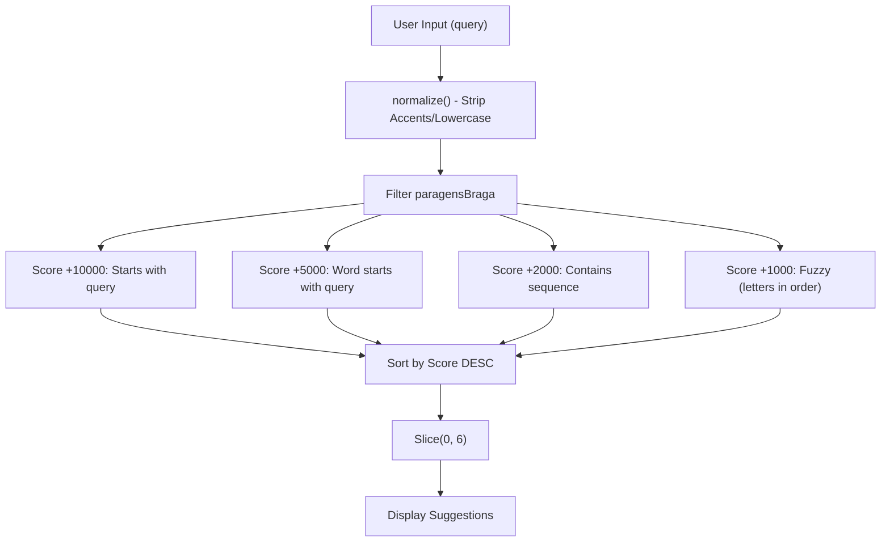
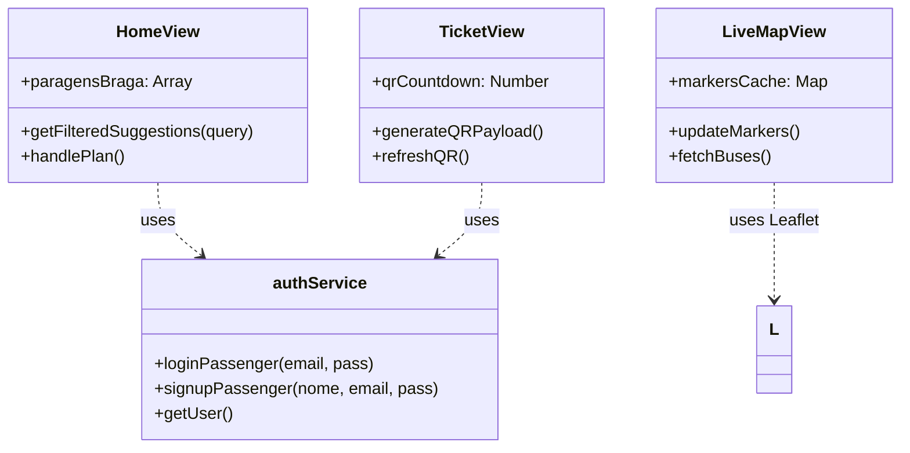

# PWA do Passageiro — Interface Móvel

A PWA do Passageiro (Progressive Web App) é a interface otimizada para mobile da plataforma PGU/TUB, concebida para os utilizadores dos transportes em Braga. Disponibiliza acompanhamento de veículos em tempo real, planeamento de rotas com indicação de lotação, bilhética digital e gestão de perfil. A interface é construída com Vue 3 e usa Leaflet para mapas, contando com um motor de sincronização à medida para garantir um desempenho fluído em dispositivos móveis.

## 1. Layout do Sistema e Fluxo de Dados

A experiência do passageiro está encapsulada no layout `PassengerApp`, que gere a barra de navegação inferior persistente e o cabeçalho superior. O fluxo de dados é maioritariamente conduzido por polling periódico ao backend, com otimizações específicas para ambientes móveis com largura de banda baixa e elevada latência.

### Arquitetura de Sincronização de Dados
A PWA usa uma estratégia de atualização baseada em "fingerprint" para minimizar o thrashing de DOM e o consumo de bateria.

| Mecanismo | Implementação | Propósito |
|:---|:---|:---|
| **Polling** | `setInterval(fetchBuses, 5000)` | Mantém atualizadas as posições e a lotação dos veículos [frontend_vue/src/views/passenger/LiveMapView.vue:214-214](). |
| **Fingerprinting** | `JSON.stringify(newBuses.map(...))` | Compara um hash do ID e da lotação para evitar re-render se os dados não mudaram [frontend_vue/src/views/passenger/LiveMapView.vue:198-202](). |
| **Cache de Estado** | `markersCache` & `positionsCache` | Evita recriar objetos Leaflet a cada ciclo de atualização [frontend_vue/src/views/passenger/LiveMapView.vue:15-17](). |

**Fontes:** [frontend_vue/src/views/passenger/LiveMapView.vue:15-23](), [frontend_vue/src/views/passenger/LiveMapView.vue:191-206]().

## 2. HomeView: Planeador de Viagens e Sugestões

A `HomeView` funciona como página inicial, oferecendo uma saudação personalizada e um "Motor de Sugestão de Paragens" que ajuda os utilizadores a encontrar a origem e o destino da viagem.

### Motor de Sugestão de Paragens
A lógica de sugestão usa um algoritmo de pontuação multi-tier para fornecer correspondência aproximada (fuzzy matching) das paragens de Braga.

*   **Normalização:** Usa normalização `NFD` para remover diacríticos do português [frontend_vue/src/views/passenger/HomeView.vue:22-22]().
*   **Lógica Aproximada:** O motor itera pelos caracteres da query para verificar se aparecem por ordem dentro do nome da paragem, mesmo com saltos [frontend_vue/src/views/passenger/HomeView.vue:49-63]().

**Fontes:** [frontend_vue/src/views/passenger/HomeView.vue:24-71](), [frontend_vue/src/views/passenger/HomeView.vue:124-142]().

## 3. LiveMapView: Acompanhamento em Tempo Real

A `LiveMapView` implementa um mapa baseado em Leaflet otimizado especificamente para desempenho em dispositivos móveis. Visualiza a frota atual e os respetivos níveis de lotação.

### Detalhes Principais de Implementação
*   **Gestão de Marcadores:** Em vez de limpar o mapa, a vista realiza atualizações incrementais. Remove marcadores obsoletos e apenas atualiza o ícone dos existentes se a "banda de cor" da lotação (Verde/Amarelo/Vermelho) mudar [frontend_vue/src/views/passenger/LiveMapView.vue:150-189]().
*   **Segurança nas Interações:** As atualizações são bloqueadas durante os eventos `zoomstart` e `movestart` (flag `isZooming`) para evitar que os marcadores "saltem" enquanto o utilizador está a interagir com o mapa [frontend_vue/src/views/passenger/LiveMapView.vue:108-112]().
*   **Posicionamento Estável:** Como o backend pode não fornecer coordenadas GPS precisas em modo demo, `getStablePos(bus)` gera coordenadas determinísticas com base num hash do ID do autocarro [frontend_vue/src/views/passenger/LiveMapView.vue:134-147]().

### Visualização de Lotação
A lotação é mapeada para cores e etiquetas que oferecem indicações visuais rápidas aos passageiros:
*   **Livre (< 60%):** Verde (`#10b981`) [frontend_vue/src/views/passenger/LiveMapView.vue:50-50]().
*   **Moderada (60-80%):** Amarelo (`#eab308`) [frontend_vue/src/views/passenger/LiveMapView.vue:49-49]().
*   **Cheia (> 80%):** Vermelho (`#ef4444`) [frontend_vue/src/views/passenger/LiveMapView.vue:48-48]().

**Fontes:** [frontend_vue/src/views/passenger/LiveMapView.vue:47-83](), [frontend_vue/src/views/passenger/LiveMapView.vue:100-131]().

## 4. TicketView: Bilhética Digital e Anti-Fraude

A `TicketView` apresenta a representação digital do passe ou bilhete do utilizador. Inclui um sistema dinâmico de QR code concebido para evitar a partilha de bilhetes (fraude).

### Dinâmica do QR Code
O QR code não é uma imagem estática, mas uma grelha gerada que roda a cada 30 segundos.
*   **Geração de Payload:** A função `generateQRPayload()` cria uma string Base64 contendo o tipo de bilhete, o titular e um timestamp de alta resolução [frontend_vue/src/views/TicketView.vue:22-26]().
*   **Grelha Visual:** `generateQRGrid()` renderiza uma grelha 21x21. Inclui os "padrões de localização" (finder patterns) standard (os quadrados nos cantos) e uma área de dados preenchida com lógica pseudo-aleatória derivada dos códigos de carácter do payload [frontend_vue/src/views/TicketView.vue:35-62]().
*   **Auto-Renovação:** Um `setInterval` gere uma contagem decrescente de 30 segundos, despoletando `refreshQR()` no fim [frontend_vue/src/views/TicketView.vue:78-88]().

**Fontes:** [frontend_vue/src/views/passenger/TicketView.vue:8-32](), [frontend_vue/src/views/passenger/TicketView.vue:133-164]().

## 5. Perfil e Autenticação

A autenticação dos passageiros é tratada via `authService`, com foco na longevidade da sessão.

### Gestão de Sessão
*   **Login Persistente:** Os passageiros usam `localStorage` para o armazenamento de sessão, ao contrário dos administradores que usam `sessionStorage` [frontend_vue/src/services/auth.js]().
*   **Tratamento de Expiração:** Se uma sessão exceder os 7 dias, a `LoginView` apresenta um banner `sessionExpired` e força um novo login [frontend_vue/src/views/passenger/LoginView.vue:17-23]().
*   **Integração de Perfil:** `ProfileView` obtém dados extendidos do utilizador (como NIF e estado do passe mensal) a partir do endpoint `/api/auth/profile/{id}` [frontend_vue/src/views/passenger/ProfileView.vue:18-32]().

### Mapeamento de Entidades de Código

**Fontes:** [frontend_vue/src/views/passenger/LoginView.vue:25-42](), [frontend_vue/src/views/passenger/ProfileView.vue:10-16](), [frontend_vue/src/views/passenger/HomeView.vue:4-5]().
