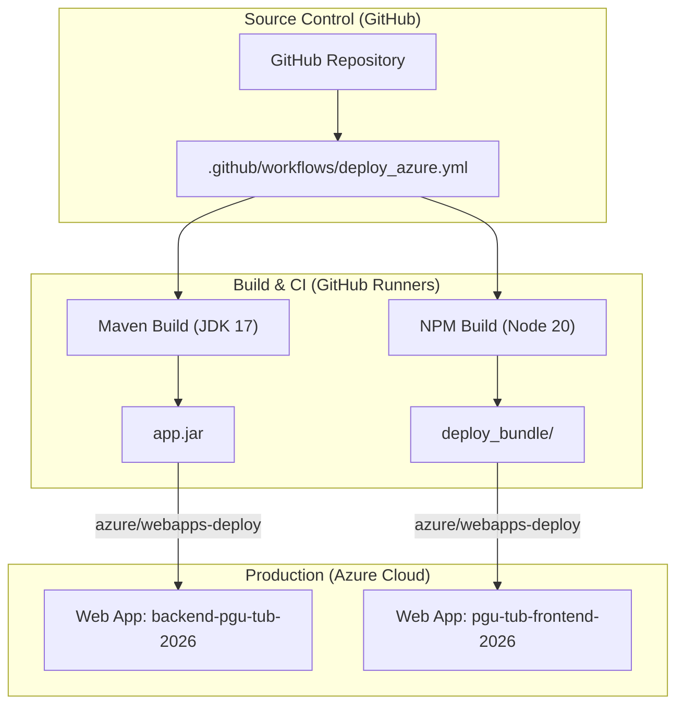
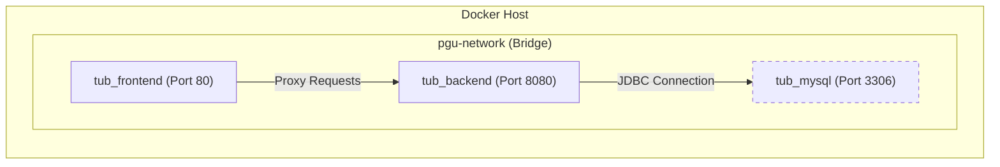

# Infraestrutura e Deployment

A plataforma PGU/TUB utiliza uma stack de infraestrutura moderna concebida para escalabilidade, portabilidade e entrega automatizada. O sistema está arquitetado para correr em três ambientes principais: desenvolvimento local (Docker), integração contínua (GitHub Actions) e produção em cloud (Azure Web Apps).

## Visão Geral da Infraestrutura

A infraestrutura PGU está dividida em três camadas funcionais que espelham a arquitetura aplicacional. Cada camada é gerida através de ferramentas específicas para garantir consistência entre ambientes.

| Camada | Tecnologia | Entidade de Código |
| :--- | :--- | :--- |
| **Compute** | Azure Web Apps / Containers Docker | `backend-pgu-tub-2026`, `pgu-tub-frontend-2026` |
| **Persistência** | MySQL 8.0 | Container `tub_mysql` / `init.sql` |
| **Automação** | GitHub Actions | `.github/workflows/deploy_azure.yml` |
| **Networking** | Bridge Docker / Azure App Service Plan | `pgu-network` |

### Mapa de Deployment do Sistema

O diagrama seguinte ilustra a relação entre os repositórios de código, o processo de build e os destinos finais de deployment.

**Deployment Flow: Source to Cloud**

**Fontes:** [.github/workflows/deploy_azure.yml:1-67](), [backend_java/pom.xml:52-63]()

---

## CI/CD — GitHub Actions e Azure

O projeto implementa uma pipeline automatizada usando GitHub Actions para garantir que cada push para o branch `main` é validado e implantado.

A pipeline está dividida em duas tarefas paralelas:
1.  **`deploy-backend`**: Compila o código fonte Java usando Maven, com JDK 17, e produz um `app.jar` standalone. Este é enviado para a Azure Web App `backend-pgu-tub-2026`.
2.  **`deploy-frontend`**: Executa `npm run build`, empacota os ficheiros estáticos resultantes com um proxy Node.js `server.js` e implanta o bundle em `pgu-tub-frontend-2026`.

Para detalhes sobre gestão de segredos, o proxy Node.js de produção e os triggers do workflow, consulte **[CI/CD — GitHub Actions e Deployment Azure](14-CICD-GitHub-Actions-Azure.md)**.

**Fontes:** [.github/workflows/deploy_azure.yml:8-32](), [.github/workflows/deploy_azure.yml:33-67]()

---

## Docker e Configuração de Containers

Para desenvolvimento local e paridade entre ambientes, o sistema fornece uma configuração `docker-compose.yml`. Esta permite que os programadores arranquem todo o ecossistema — Base de Dados, Backend e Frontend — com um único comando.

**Container Architecture**

A configuração utiliza uma rede bridge privada `pgu-network` para que os serviços possam comunicar através do nome do container (por exemplo, o backend liga-se a `jdbc:mysql://mysql:3306/tub`).

Para detalhes sobre as definições dos Dockerfiles, configurações de Nginx para o frontend e overrides de variáveis de ambiente, consulte **[Docker e Configuração de Containers](15-Docker-e-Containers.md)**.

**Fontes:** [docker-compose.yml:1-51](), [backend_java/pom.xml:17-21]()

---

## Simulador de Sensores IoT e Ferramentas de Teste

Para validar a capacidade da infraestrutura de processar dados em tempo real sem necessitar de hardware físico de autocarro, está incluída uma suíte de testes especializada.

*   **Simulador de Sensores**: Uma ferramenta baseada no browser (`simulador_sensores.html`) que simula a pipeline EDA de 4 etapas enviando pedidos HTTP POST para a API do backend.
*   **Importadores de Dados**: Scripts e recursos CSV localizados em `07_Anexos_e_Historico/` usados para popular a base de dados com dados de horários TUB para as linhas 07H, 40H e 43H.
*   **Testes Unitários**: A suíte `SistemaTest.java` garante a integridade da lógica de negócio antes do deployment.

Para detalhes sobre a simulação de limiares de lotação e o processo de importação de dados de horários, consulte **[Simulador de Sensores IoT e Ferramentas de Teste](16-Simulador-IoT-e-Testes.md)**.

**Fontes:** [backend_java/pom.xml:45-49](), [docker-compose.yml:14-15]()
