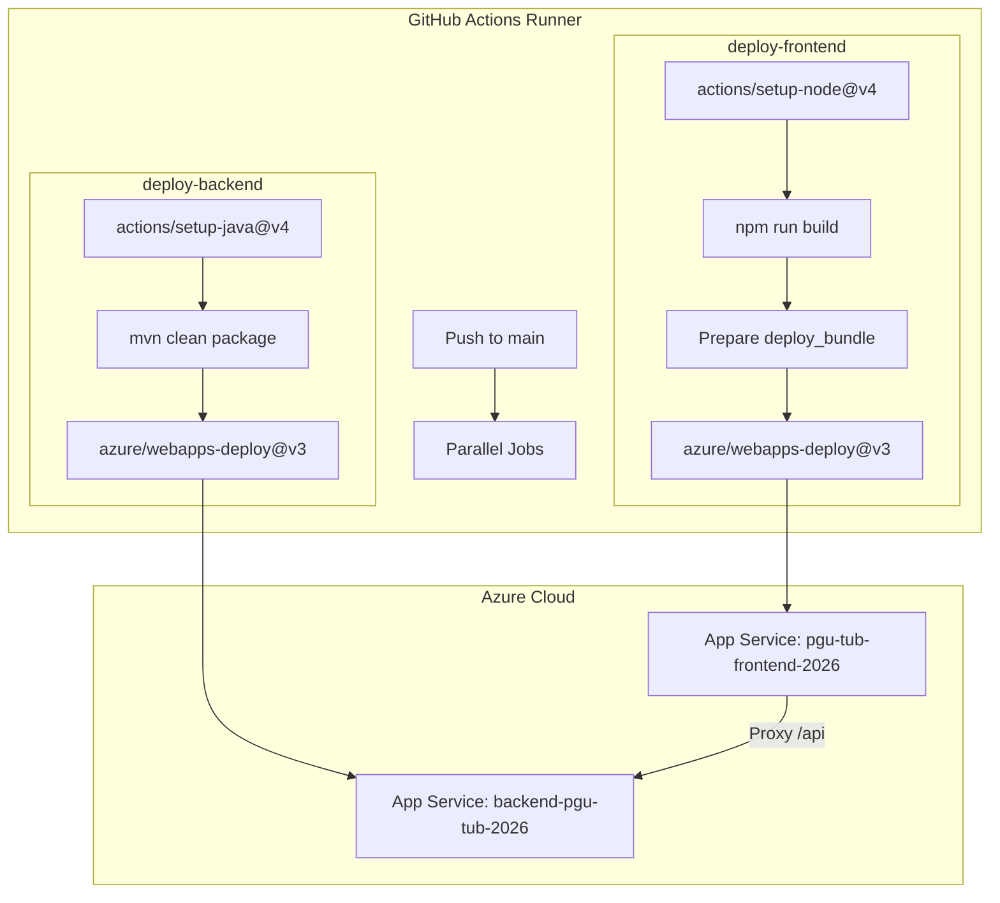
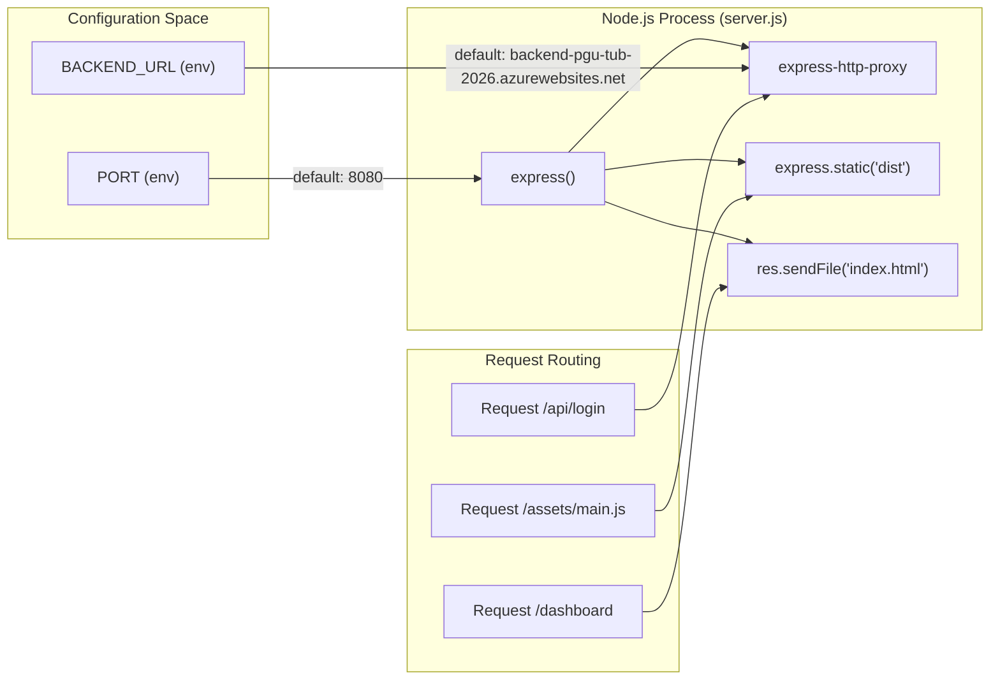

# CI/CD — GitHub Actions e Deployment Azure

Esta página documenta a pipeline automatizada de integração e deployment do sistema PGU (Plataforma de Gestão Unificada). O projeto utiliza GitHub Actions para orquestrar uma estratégia de deployment de duplo caminho que constrói e envia o backend Spring Boot e o frontend Vue.js para instâncias independentes de Azure App Service.

## Visão Geral do Workflow

O deployment é gerido pelo workflow `Deploy PGU to Azure`, despoletado automaticamente em cada push para o branch `main` ou manualmente via `workflow_dispatch` [.github/workflows/deploy_azure.yml:1-7](). O workflow executa duas tarefas em paralelo: `deploy-backend` e `deploy-frontend` [.github/workflows/deploy_azure.yml:10-34]().

### Arquitetura CI/CD

O diagrama seguinte ilustra o fluxo, desde o commit do código até aos ambientes Azure em produção.

**Deployment Pipeline Flow**

Fontes: [.github/workflows/deploy_azure.yml:1-67]()

---

## Deployment do Backend (Spring Boot)

A tarefa `deploy-backend` compila o código fonte Java num ficheiro JAR executável, otimizado para o ambiente Azure.

### Detalhes de Implementação
1. **Ambiente**: Usa `ubuntu-latest` com JDK 17 (distribuição Temurin) [.github/workflows/deploy_azure.yml:11-19]().
2. **Build**: Executa `mvn clean package -DskipTests` na diretoria `backend_java` [.github/workflows/deploy_azure.yml:23-24]().
3. **Artefacto**: O build produz `app.jar` conforme definido na configuração `finalName` do Maven [backend_java/pom.xml:53-53]().
4. **Push para Azure**: Implanta o JAR no App Service `backend-pgu-tub-2026` usando o segredo `AZURE_BACKEND_PUBLISH_PROFILE` [.github/workflows/deploy_azure.yml:29-31]().

**Configuração-chave do Maven**
| Propriedade | Valor |
| :--- | :--- |
| Versão de Java | 17 [backend_java/pom.xml:18-19]() |
| Classe Principal | `pt.uminho.dai.pgu.api.Programa` [backend_java/pom.xml:59-59]() |
| Artefacto Final | `app.jar` [backend_java/pom.xml:53-53]() |

Fontes: [.github/workflows/deploy_azure.yml:10-32](), [backend_java/pom.xml:1-64]()

---

## Deployment do Frontend (Vue.js e Proxy Node.js)

O deployment do frontend é mais complexo, pois envolve a compilação da SPA Vue 3 e o seu empacotamento num servidor Express.js pronto para produção, capaz de tratar routing e proxy de pedidos da API.

### Preparação do Bundle
Ao contrário do ambiente de desenvolvimento, o deployment de produção cria um `deploy_bundle` contendo:
* A pasta `dist/` (assets estáticos minificados produzidos por `vite build`) [.github/workflows/deploy_azure.yml:55-55]().
* `server.js`: O servidor Node.js de produção [.github/workflows/deploy_azure.yml:56-56]().
* `package.json`: Necessário para a resolução de dependências em Azure [.github/workflows/deploy_azure.yml:57-57]().

O workflow executa `npm install --omit=dev` dentro deste bundle para minimizar o tamanho do deployment [.github/workflows/deploy_azure.yml:59-59]().

### Servidor de Produção (server.js)
Em produção, a aplicação Vue é servida por um servidor Express que desempenha três funções críticas:
1. **Proxy de API**: Redireciona todos os pedidos que começam por `/api` para o URL do backend definido em `BACKEND_URL` [frontend_vue/server.js:13-18]().
2. **Hosting de Estáticos**: Serve os recursos gerados a partir da diretoria `dist` [frontend_vue/server.js:21-21]().
3. **Fallback de SPA**: Redireciona todos os pedidos não-ficheiro para `index.html`, suportando o modo HTML5 History do Vue Router [frontend_vue/server.js:24-26]().

**Mapeamento de Entidades: Ambiente de Produção do Frontend**

Fontes: [frontend_vue/server.js:1-31](), [.github/workflows/deploy_azure.yml:52-60]()

---

## Gestão de Segredos e Ambiente

O workflow depende dos GitHub Repository Secrets para autenticar com o Azure sem expor credenciais.

| Nome do Segredo | Propósito |
| :--- | :--- |
| `AZURE_BACKEND_PUBLISH_PROFILE` | Perfil de publicação XML para a Web App de Java [.github/workflows/deploy_azure.yml:30-30]() |
| `AZURE_FRONTEND_PUBLISH_PROFILE` | Perfil de publicação XML para a Web App de Node.js [.github/workflows/deploy_azure.yml:65-65]() |

### Variáveis de Ambiente em Runtime
O `server.js` do frontend utiliza variáveis de ambiente que podem ser configuradas no Azure Portal:
* `PORT`: Porta em que o servidor Express escuta (por omissão `8080`) [frontend_vue/server.js:10-10]().
* `BACKEND_URL`: Destino do proxy da API (por omissão `backend-pgu-tub-2026.azurewebsites.net`) [frontend_vue/server.js:11-11]().

Fontes: [.github/workflows/deploy_azure.yml:26-67](), [frontend_vue/server.js:9-11]()
