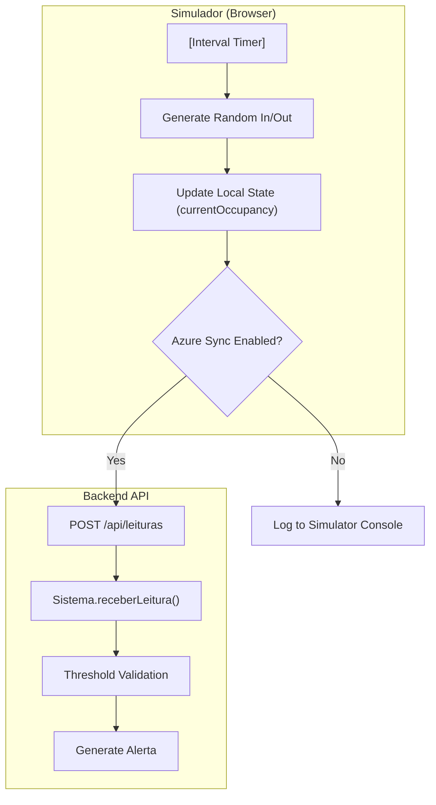

# Simulador de Sensores IoT e Ferramentas de Teste

A plataforma PGU/TUB inclui um conjunto de ferramentas concebidas para simular a ingestão de dados IoT em condições reais, validar a lógica de negócio através de testes automatizados e gerir dados históricos de horários da rede de transportes. Estas ferramentas asseguram a robustez da Arquitetura Orientada a Eventos (EDA) e a precisão dos alertas de lotação.

## 1. Simulador de Sensores IoT

O `tools/simulador_sensores.html` é uma utilitário standalone, baseado em browser, que simula o comportamento dos sensores de hardware instalados nos autocarros TUB. Imita a pipeline EDA de 4 etapas: **Geração de Dados**, **Ingestão**, **Processamento** e **Alerta**.

### 1.1 Implementação e Funcionalidades
O simulador é construído com uma UI moderna usando variáveis CSS e oferece uma visualização em tempo real do fluxo de dados [tools/simulador_sensores.html:15-39]().

*   **Configuração do Autocarro**: Os utilizadores podem definir a `matricula` e a `lotacao_maxima` [tools/simulador_sensores.html:436-440]().
*   **Gestão de Limiares**: O simulador permite ajustar em tempo real os limiares usados pela lógica do backend, tais como:
    *   `limiar_ocupacao`: Percentagem (por exemplo, 90%) que despoleta um alerta de lotação elevada.
    *   `limiar_anomalia`: Número de passageiros que entram/saem em simultâneo que despoleta um alerta de anomalia.
    *   `intervalo_maximo`: Tempo máximo permitido entre leituras de sensor antes de ser gerado um alerta de "ausência de dados" [tools/simulador_sensores.html:442-446]().
*   **Toggle de Sincronização Azure**: Um interruptor para alternar entre a simulação local e o envio em direto de pedidos POST para a API backend alojada em Azure (`/api/leituras`) [tools/simulador_sensores.html:450-454]().

### 1.2 Lógica do Fluxo de Dados
O simulador mantém um estado interno para o autocarro, acompanhando a lotação atual e gerando eventos aleatórios de "Entrada/Saída" com base na frequência definida pelo utilizador [tools/simulador_sensores.html:553-565]().

**Sensor Simulation Data Flow**

*Fontes: [tools/simulador_sensores.html:573-610](), [tools/simulador_sensores.html:623-640]()*

---

## 2. Dados de Horários e Registos Históricos

A diretoria `07_Anexos_e_Historico/` contém os dados de referência (ground-truth) para a rede TUB, especificamente para as linhas **07H**, **40H** e **43H**. Estes dados são usados para popular o sistema e validar a lotação simulada face à procura esperada.

### 2.1 Estruturas de Dados
*   **Horários**: Disponibilizados em formatos PDF e CSV. Os ficheiros CSV contêm sequências de paragens estruturadas e horas de chegada.
*   **Procura Histórica**: Documentação sobre a distinção entre "passes" (pré-pagos) e "tickets" (comprados a bordo), o que informa a lógica de contagem de passageiros [docs/notas_requisitos.txt:6-10]().

### 2.2 Importação de Horários
O sistema usa estes ficheiros para inicializar as entidades `Linha` e `Paragem` na base de dados durante a fase de setup.

| Linha | Descrição da Rota | Ficheiros Principais |
| :--- | :--- | :--- |
| **07H** | Circular Urbana | `07H_horarios.csv`, `07H_mapa.pdf` |
| **40H** | Ligação Residencial | `40H_horarios.csv` |
| **43H** | Universidade / Hospital | `43H_horarios.csv` |

*Fontes: [docs/notas_requisitos.txt:1-10]()*

---

## 3. Suíte de Testes Automatizados

A suíte `SistemaTest.java` fornece testes unitários para a lógica de negócio principal tratada pela classe `Sistema`. Utiliza uma configuração de repositório em memória para isolar a lógica da base de dados.

### 3.1 Cenários de Teste
A suíte de testes valida os quatro principais tipos de alerta definidos no sistema.

| Método de Teste | Regra de Negócio Validada | Referência ao Código |
| :--- | :--- | :--- |
| `deveGerarAlertaQuandoOcupacaoUltrapassaNoventaPorCento` | Despoleta `TipoAlerta.OCUPACAO_ACIMA_DO_LIMIAR` quando a lotação > limiar. | [backend_java/src/test/java/pt/uminho/dai/pgu/services/SistemaTest.java:24-32]() |
| `deveGerarAlertaQuandoEntramSeteOuMaisPassageirosEmSimultaneo` | Despoleta `TipoAlerta.LEITURA_ANOMALA_ENTRADA` para picos de embarque. | [backend_java/src/test/java/pt/uminho/dai/pgu/services/SistemaTest.java:34-42]() |
| `deveGerarAlertaQuandoSaemSeteOuMaisPassageirosEmSimultaneo` | Despoleta `TipoAlerta.LEITURA_ANOMALA_SAIDA` para picos de saída. | [backend_java/src/test/java/pt/uminho/dai/pgu/services/SistemaTest.java:44-53]() |
| `deveGerarAlertaQuandoExisteAusenciaDeLeiturasPorPeriodoProlongado` | Despoleta `TipoAlerta.AUSENCIA_DE_LEITURAS` se o intervalo > limiar. | [backend_java/src/test/java/pt/uminho/dai/pgu/services/SistemaTest.java:55-65]() |

### 3.2 Mapeamento de Entidades de Código
O diagrama seguinte mapeia as entidades de teste para as classes de produção que exercitam.

**Test-to-Code Mapping**
```mermaid
classDiagram
    class "SistemaTest" {
        +criarSistemaEmMemoria()
        +deveGerarAlertaQuandoOcupacaoUltrapassaNoventaPorCento()
    }
    class "Sistema" {
        +receberLeitura(matricula, entrou, saiu, instante)
        +registarAutocarro(matricula, lotacao)
    }
    class "ThresholdsAlerta" {
        +double limiarOcupacao
        +int limiarAnomalia
        +Duration intervaloMaximo
    }
    class "RepositorioLeituras" {
        +boolean inMemory
    }

    "SistemaTest" ..> "Sistema" : exercises
    "Sistema" --> "ThresholdsAlerta" : uses for logic
    "Sistema" --> "RepositorioLeituras" : persists data
```
*Fontes: [backend_java/src/test/java/pt/uminho/dai/pgu/services/SistemaTest.java:12-22](), [backend_java/src/test/java/pt/uminho/dai/pgu/services/SistemaTest.java:26-29]()*

---

## 4. Integração e Diagnóstico

A combinação do `simulador_sensores.html` e da suíte `SistemaTest.java` permite um ciclo de diagnóstico completo:
1.  **Validação Unitária**: Garantir que `Sistema.java` identifica corretamente os alertas via `SistemaTest`.
2.  **Simulação End-to-End**: Usar o simulador no browser para enviar dados para a API Azure.
3.  **Verificação Visual**: Observar os alertas gerados a aparecer na **AlertsCenterView** do Backoffice Vue.js.

*Fontes: [tools/simulador_sensores.html:642-655](), [backend_java/src/test/java/pt/uminho/dai/pgu/services/SistemaTest.java:1-12]()*
