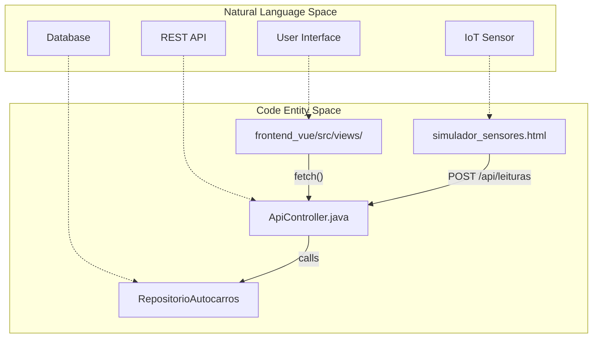
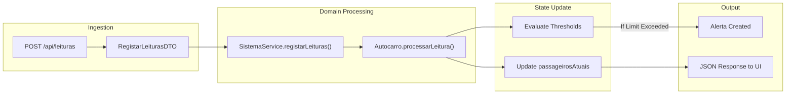

# Glossário

Esta página fornece uma referência abrangente para termos técnicos, vocabulário de domínio e conceitos arquiteturais específicos da plataforma PGU/TUB. Serve como ponte entre os requisitos de negócio dos **Transportes Urbanos de Braga (TUB)** e a implementação técnica no código.

## 1. Entidades Centrais de Domínio

Estes termos representam os principais objetos de negócio utilizados no sistema para modelar o transporte público e a gestão de frota.

| Termo | Descrição | Entidade de Código |
|:---|:---|:---|
| **Autocarro** | Um veículo da frota. Acompanha lotação em tempo real, capacidade e histórico operacional. | `Autocarro.java` [backend_java/src/main/java/pt/uminho/dai/pgu/models/Autocarro.java:12-12]() |
| **Linha** | Uma rota de transporte definida (por exemplo, 07H, 43H) que contém uma sequência de paragens. | `RegistarLinhaDTO.java` [backend_java/src/main/java/pt/uminho/dai/pgu/api/ApiController.java:5-5]() |
| **Paragem** | Localização física de uma paragem de autocarro. Usada no planeamento de viagens e na visualização do mapa em tempo real. | `LiveMapView.vue` [frontend_vue/src/views/passenger/LiveMapView.vue:25-45]() |
| **Leitura** | Evento de sensor que regista o número de passageiros que entram ou saem de um autocarro. | `LeituraContagem` [backend_java/src/main/java/pt/uminho/dai/pgu/models/Autocarro.java:121-121]() |
| **Lotação** | Nível de ocupação atual do autocarro, frequentemente expresso como percentagem da capacidade total. | `lotLabel` [frontend_vue/src/views/passenger/HomeView.vue:158-162]() |

**Fontes:** [backend_java/src/main/java/pt/uminho/dai/pgu/models/Autocarro.java:12-44](), [frontend_vue/src/views/passenger/LiveMapView.vue:25-45]()

---

## 2. Conceitos Arquiteturais

### Método 4SRS
O sistema é estruturado segundo o método **4SRS (4-Step Recursive Selection)**, que mapeia requisitos para camadas arquiteturais:
* **P5 (UI):** Aplicação frontend Vue.js [README.md:13-13]().
* **P2 (Lógica de Negócio):** Backend Spring Boot e ingestão IoT [README.md:14-14]().
* **P7 (Dados):** Camada de persistência MySQL [README.md:15-15]().

### Pipeline de Ingestão IoT
Fluxo de dados desde os sensores físicos (ou simulados) até ao dashboard:
1. **Geração de Eventos:** O `simulador_sensores.html` gera payloads JSON [tools/simulador_sensores.html:1-1]().
2. **Ingestão na API:** O `ApiController` recebe dados em `/api/leituras` [backend_java/src/main/java/pt/uminho/dai/pgu/api/ApiController.java:82-82]().
3. **Processamento:** O `SistemaService` delega em `Autocarro.processarLeitura()` [backend_java/src/main/java/pt/uminho/dai/pgu/models/Autocarro.java:121-121]().
4. **Alertas:** Os limiares são avaliados e objetos `Alerta` são criados quando excedidos [backend_java/src/main/java/pt/uminho/dai/pgu/models/Autocarro.java:174-181]().

### Diagrama: Mapeamento de Linguagem Natural para Código (Arquitetura)

Title: Architectural Entity Mapping

**Fontes:** [README.md:7-31](), [backend_java/src/main/java/pt/uminho/dai/pgu/api/ApiController.java:30-40](), [tools/simulador_sensores.html:1-10]()

---

## 3. Termos Técnicos e Abreviaturas

* **Automatic Payment Methods (Stripe):** Configuração no Stripe que ativa dinamicamente múltiplos meios de pagamento (MB WAY, Cartão, Revolut Pay, Link, Bancontact, etc.) com base nas definições da dashboard do comerciante, sem necessidade de alterar código [backend_java/src/main/java/pt/uminho/dai/pgu/api/PaymentController.java:81-85]().
* **DTO (Data Transfer Object):** Objetos usados para encapsular dados em pedidos/respostas da API (por exemplo, `RegistarAutocarroDTO`) [backend_java/src/main/java/pt/uminho/dai/pgu/api/ApiController.java:3-11]().
* **EDA (Event-Driven Architecture):** Padrão usado pelo simulador IoT para enviar dados para o backend [tools/simulador_sensores.html:6-7]().
* **Fingerprint:** String do tipo hash gerada no frontend para detetar alterações de dados e evitar re-renders desnecessários do DOM em `LiveMapView.vue` [frontend_vue/src/views/passenger/LiveMapView.vue:198-202]().
* **Modo Demo:** Estado do frontend que permite à aplicação funcionar com dados mock quando o backend está inacessível [frontend_vue/src/views/passenger/HomeView.vue:108-115]().
* **Payment Element (Stripe):** Componente de UI dinâmico e seguro fornecido pelo Stripe que é montado diretamente na interface Vue.js para recolher dados de pagamento de forma segura e em conformidade com PCI-DSS [frontend_vue/src/views/passenger/BuyTicketView.vue:262-262]().
* **PaymentIntent (Stripe):** Objeto de estado do Stripe que representa uma transação financeira em curso, acompanhando o seu ciclo de vida desde a intenção de compra até ao sucesso [backend_java/src/main/java/pt/uminho/dai/pgu/api/PaymentController.java:75-86]().
* **Stripe Webhook:** Endpoint no backend (`/api/payments/webhook`) registado no Stripe para receber notificações HTTP assíncronas sobre eventos de pagamento (ex: `payment_intent.succeeded`) com validação rigorosa de assinatura digital [backend_java/src/main/java/pt/uminho/dai/pgu/api/PaymentController.java:116-127]().
* **Validação Zero-Trust:** Prática de validar todos os pedidos recebidos usando `@Valid` e anotações Jakarta Bean Validation [backend_java/src/main/java/pt/uminho/dai/pgu/api/ApiController.java:41-44]().

**Fontes:** [backend_java/src/main/java/pt/uminho/dai/pgu/api/ApiController.java:41-80](), [frontend_vue/src/views/passenger/LiveMapView.vue:22-23](), [frontend_vue/src/views/passenger/HomeView.vue:105-108](), [backend_java/src/main/java/pt/uminho/dai/pgu/api/PaymentController.java:1-267]().

---

## 4. Lógica de Domínio e Limiares

O sistema monitoriza condições específicas definidas em `ThresholdsAlerta` para manter a qualidade do serviço.

| Tipo | Definição | Implementação |
|:---|:---|:---|
| **Ocupação Excessiva** | Despoletado quando `getTaxaOcupacao()` ultrapassa um limiar definido (por exemplo, 80%). | `TipoAlerta.OCUPACAO_ACIMA_DO_LIMIAR` [backend_java/src/main/java/pt/uminho/dai/pgu/models/Autocarro.java:174-174]() |
| **Ausência de Leituras** | Despoletado quando um autocarro não reporta dados dentro de um determinado `Duration`. | `TipoAlerta.AUSENCIA_DE_LEITURAS` [backend_java/src/main/java/pt/uminho/dai/pgu/models/Autocarro.java:131-133]() |
| **Leitura Anómala** | Despoletado quando uma única leitura reporta um número impossível de embarques/desembarques. | `TipoAlerta.LEITURA_ANOMALA_ENTRADA` [backend_java/src/main/java/pt/uminho/dai/pgu/models/Autocarro.java:140-142]() |

### Diagrama: Fluxo de Dados da Lógica de Negócio

Title: Occupancy and Alert Processing Flow

**Fontes:** [backend_java/src/main/java/pt/uminho/dai/pgu/api/ApiController.java:82-94](), [backend_java/src/main/java/pt/uminho/dai/pgu/models/Autocarro.java:121-184]()

---

## 5. Componentes de UI (PWA do Passageiro)

* **Trip Planner:** Motor de pesquisa em `HomeView.vue` que utiliza um algoritmo de fuzzy matching para sugerir paragens [frontend_vue/src/views/passenger/HomeView.vue:24-71]().
* **Stable Position Cache:** Mecanismo em `LiveMapView.vue` que utiliza hashing determinístico dos IDs dos autocarros para atribuir coordenadas de mapa sem necessidade de dados GPS do simulador [frontend_vue/src/views/passenger/LiveMapView.vue:134-147]().
* **LotColor:** Função utilitária que mapeia percentagens de lotação para cores específicas da UI (Verde: Livre, Âmbar: Moderada, Vermelho: Cheia) [frontend_vue/src/views/passenger/LiveMapView.vue:47-51]().

**Fontes:** [frontend_vue/src/views/passenger/HomeView.vue:24-71](), [frontend_vue/src/views/passenger/LiveMapView.vue:47-51](), [frontend_vue/src/views/passenger/LiveMapView.vue:134-147]()
